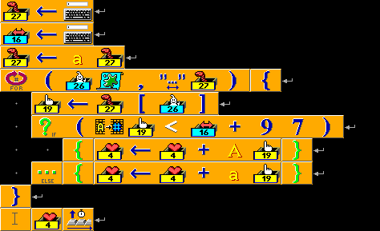

<h1 style='text-align: center;'> D. Orange</h1>

<h5 style='text-align: center;'>time limit per test: 2 seconds</h5>
<h5 style='text-align: center;'>memory limit per test: 256 megabytes</h5>

  ## Input

The first line of the input is a string (between 1 and 50 characters long, inclusive). Each character will be a letter of English alphabet, lowercase or uppercase.

The second line of the input is an integer between 0 and 26, inclusive.

## Output

## Output

 the required string.

## Examples

## Input


```
AprilFool  
14  

```
## Output


```
AprILFooL  

```


#### tags 

#1400 #*special #implementation 