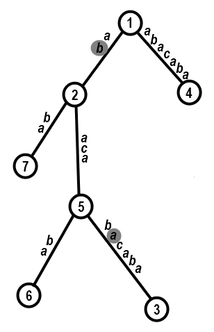

<h1 style='text-align: center;'> E. Tree-String Problem</h1>

<h5 style='text-align: center;'>time limit per test: 1 second</h5>
<h5 style='text-align: center;'>memory limit per test: 256 megabytes</h5>

A rooted tree is a non-directed connected graph without any cycles with a distinguished vertex, which is called the tree root. Consider the vertices of a rooted tree, that consists of *n* vertices, numbered from 1 to *n*. In this problem the tree root is the vertex number 1.

Let's represent the length of the shortest by the number of edges path in the tree between vertices *v* and *u* as *d*(*v*, *u*).

A parent of vertex *v* in the rooted tree with the root in vertex *r* (*v* ≠ *r*) is vertex *p**v*, such that *d*(*r*, *p**v*) + 1 = *d*(*r*, *v*) and *d*(*p**v*, *v*) = 1. For example, on the picture the parent of vertex *v* = 5 is vertex *p*5 = 2.

One day Polycarpus came across a rooted tree, consisting of *n* vertices. The tree wasn't exactly ordinary: it had strings written on its edges. Polycarpus positioned the tree on the plane so as to make all edges lead from top to bottom if you go from the vertex parent to the vertex (see the picture). For any edge that lead from vertex *p**v* to vertex *v* (1 < *v* ≤ *n*), he knows string *s**v* that is written on it. All strings are written on the edges from top to bottom. For example, on the picture *s*7="ba". The characters in the strings are numbered starting from 0.

  An example of Polycarpus's tree (corresponds to the example from the statement) Polycarpus defines the position in this tree as a specific letter on a specific string. The position is written as a pair of integers (*v*, *x*) that means that the position is the *x*-th letter of the string *s**v* (1 < *v* ≤ *n*, 0 ≤ *x* < |*s**v*|), where |*s**v*| is the length of string *s**v*. For example, the highlighted letters are positions (2, 1) and (3, 1).

Let's consider the pair of positions (*v*, *x*) and (*u*, *y*) in Polycarpus' tree, such that the way from the first position to the second goes down on each step. We will consider that the pair of such positions defines string *z*. String *z* consists of all letters on the way from (*v*, *x*) to (*u*, *y*), written in the order of this path. For example, in the picture the highlighted positions define string "bacaba".

Polycarpus has a string *t*, he wants to know the number of pairs of positions that define string *t*. ## Note

 that the way from the first position to the second in the pair must go down everywhere. Help him with this challenging tree-string problem!

## Input

The first line contains integer *n* (2 ≤ *n* ≤ 105) — the number of vertices of Polycarpus's tree. Next *n* - 1 lines contain the tree edges. The *i*-th of them contains number *p**i* + 1 and string *s**i* + 1 (1 ≤ *p**i* + 1 ≤ *n*; *p**i* + 1 ≠ (*i* + 1)). String *s**i* + 1 is non-empty and consists of lowercase English letters. The last line contains string *t*. String *t* consists of lowercase English letters, its length is at least 2.

It is guaranteed that the input contains at most 3·105 English letters.

## Output

Print a single integer — the required number.

Please, do not use the %lld specifier to read or write 64-bit integers in С++. It is preferred to use the cin, cout streams or the %I64d specifier.

## Examples

## Input


```
7  
1 ab  
5 bacaba  
1 abacaba  
2 aca  
5 ba  
2 ba  
aba  

```
## Output


```
6  

```
## Input


```
7  
1 ab  
5 bacaba  
1 abacaba  
2 aca  
5 ba  
2 ba  
bacaba  

```
## Output


```
4  

```
## Note

In the first test case string "aba" is determined by the pairs of positions: (2, 0) and (5, 0); (5, 2) and (6, 1); (5, 2) and (3, 1); (4, 0) and (4, 2); (4, 4) and (4, 6); (3, 3) and (3, 5).

## Note

 that the string is not defined by the pair of positions (7, 1) and (5, 0), as the way between them doesn't always go down.


#### tags 

#2000 #*special #dfs_and_similar #hashing #strings 