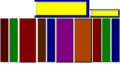

<h1 style='text-align: center;'> B. Shaass and Bookshelf</h1>

<h5 style='text-align: center;'>time limit per test: 1 second</h5>
<h5 style='text-align: center;'>memory limit per test: 256 megabytes</h5>

Shaass has *n* books. He wants to make a bookshelf for all his books. He wants the bookshelf's dimensions to be as small as possible. The thickness of the *i*-th book is *t**i* and its pages' width is equal to *w**i*. The thickness of each book is either 1 or 2. All books have the same page heights.

  Shaass puts the books on the bookshelf in the following way. First he selects some of the books and put them vertically. Then he puts the rest of the books horizontally above the vertical books. The sum of the widths of the horizontal books must be no more than the total thickness of the vertical books. A sample arrangement of the books is depicted in the figure.

  Help Shaass to find the minimum total thickness of the vertical books that we can achieve.

## Input

The first line of the input contains an integer *n*, (1 ≤ *n* ≤ 100). Each of the next *n* lines contains two integers *t**i* and *w**i* denoting the thickness and width of the *i*-th book correspondingly, (1 ≤ *t**i* ≤ 2, 1 ≤ *w**i* ≤ 100).

## Output

On the only line of the output print the minimum total thickness of the vertical books that we can achieve.

## Examples

## Input


```
5  
1 12  
1 3  
2 15  
2 5  
2 1  

```
## Output


```
5  

```
## Input


```
3  
1 10  
2 1  
2 4  

```
## Output


```
3  

```


#### tags 

#1700 #dp #greedy 