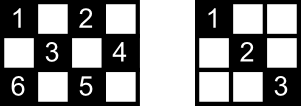

<h1 style='text-align: center;'> D. Shaass and Painter Robot</h1>

<h5 style='text-align: center;'>time limit per test: 2 seconds</h5>
<h5 style='text-align: center;'>memory limit per test: 256 megabytes</h5>

Shaass thinks a kitchen with all white floor tiles is so boring. His kitchen floor is made of *n*·*m* square tiles forming a *n* × *m* rectangle. Therefore he's decided to color some of the tiles in black so that the floor looks like a checkerboard, which is no two side-adjacent tiles should have the same color.

Shaass wants to use a painter robot to color the tiles. In the beginning the robot is standing in a border tile (*x**s*, *y**s*) facing a diagonal direction (i.e. upper-left, upper-right, down-left or down-right). As the robot walks in the kitchen he paints every tile he passes even if it's painted before. Painting each tile consumes one unit of black paint. If at any moment the robot hits a wall of the kitchen he changes his direction according the reflection rules. Note that a tile gets painted when the robot enters the tile from another tile, in other words changing direction in the same tile doesn't lead to any painting. The first tile the robot is standing on, is also painted.

The robot stops painting the first moment the floor is checkered. Given the dimensions of the kitchen and the position of the robot, find out the amount of paint the robot consumes before it stops painting the floor.

Let's consider an examples depicted below.

  If the robot starts at tile number 1 (the tile (1, 1)) of the left grid heading to down-right it'll pass tiles 1354236 and consumes 7 units of black paint on his way until he stops at tile number 6. But if it starts at tile number 1 in the right grid heading to down-right it will get stuck in a loop painting tiles 1, 2, and 3.

## Input

The first line of the input contains two integers *n* and *m*, (2 ≤ *n*, *m* ≤ 105). The second line contains two integers *x**s* and *y**s* (1 ≤ *x**s* ≤ *n*, 1 ≤ *y**s* ≤ *m*) and the direction robot is facing initially. Direction is one of the strings: "UL" (upper-left direction), "UR" (upper-right), "DL" (down-left) or "DR" (down-right).

Note, that record (*x**s*, *y**s*) denotes the tile that is located at the *x**s*-th row from the top and at the *y**s*-th column from the left of the kitchen.

It's guaranteed that the starting position will be a border tile (a tile with less than four side-adjacent tiles).

## Output

Print the amount of paint the robot consumes to obtain a checkered kitchen floor. Or print -1 if it never happens.

Please do not use the %lld specificator to read or write 64-bit integers in С++. It is preferred to use the cin, cout streams or the %I64d specificator.

## Examples

## Input


```
3 4  
1 1 DR  

```
## Output


```
7  

```
## Input


```
3 4  
3 3 DR  

```
## Output


```
11  

```
## Input


```
3 3  
1 1 DR  

```
## Output


```
-1  

```
## Input


```
3 3  
1 2 DL  

```
## Output


```
4  

```


#### tags 

#2500 #brute_force #implementation #number_theory 