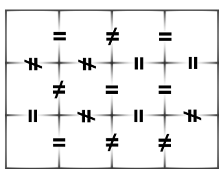
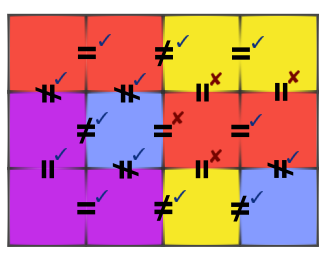

<h1 style='text-align: center;'> D. Color the Carpet</h1>

<h5 style='text-align: center;'>time limit per test: 1 second</h5>
<h5 style='text-align: center;'>memory limit per test: 256 megabytes</h5>

Even polar bears feel cold when lying on the ice. Therefore, a polar bear Alice is going to make a carpet. The carpet can be viewed as a grid with height *h* and width *w*. Then the grid is divided into *h* × *w* squares. Alice is going to assign one of *k* different colors to each square. The colors are numbered from 1 to *k*. She may choose not to use all of the colors.

However, there are some restrictions. For every two adjacent squares (squares that shares an edge) *x* and *y*, there is a color constraint in one of the forms: 

* *color*(*x*) = *color*(*y*), or
* *color*(*x*) ≠ *color*(*y*).

Example of the color constraints:

  Ideally, Alice wants to satisfy all color constraints. But again, life in the Arctic is hard. It is not always possible to satisfy all color constraints. Fortunately, she will still be happy if at least  of the color constraints are satisfied. 

If she has 4 colors she can color the carpet in the following way:

  And she is happy because  of the color constraints are satisfied, and . Your task is to help her color the carpet.

## Input

The first line contains three integers *h*, *w*, *k* (2 ≤ *h*, *w* ≤ 1000, 1 ≤ *k* ≤ *w*·*h*).

The next 2*h* - 1 lines describe the color constraints from top to bottom, left to right. They contain *w* - 1, *w*, *w* - 1, *w*, ..., *w* - 1 characters respectively. Each color constraint is represented by a character "E" or "N", where "E" means " = " and "N" means " ≠ ".

The color constraints listed in the order they are depicted on the picture.

## Output

If there is a coloring that satisfies at least  of the color constraints, print "YES" (without quotes) in the first line. In each of the next *h* lines, print *w* integers describing the coloring.

Otherwise, print "NO" (without quotes).

## Examples

## Input


```
3 4 4  
ENE  
NNEE  
NEE  
ENEN  
ENN  

```
## Output


```
YES  
1 1 2 2  
3 4 1 1  
3 3 2 4
```


#### tags 

#2500 #constructive_algorithms 