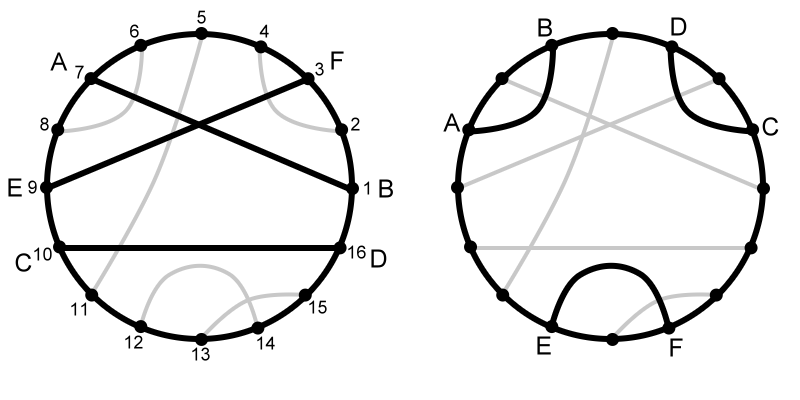

<h1 style='text-align: center;'> E. Mystic Carvings</h1>

<h5 style='text-align: center;'>time limit per test: 3 seconds</h5>
<h5 style='text-align: center;'>memory limit per test: 256 megabytes</h5>

The polar bears have discovered a gigantic circular piece of floating ice with some mystic carvings on it. There are *n* lines carved on the ice. Each line connects two points on the boundary of the ice (we call these points endpoints). The endpoints are numbered 1, 2, ..., 2*n* counter-clockwise along the circumference. No two lines share an endpoint.

Now a group of 6 polar bears (Alice, Bob, Carol, Dave, Eve, Frank) are going to build caves on the endpoints. Each polar bear would build a cave and live in it. No two polar bears can build a cave on the same endpoints. Alice and Bob is a pair of superstitious lovers. They believe the lines are carved by aliens (or humans, which are pretty much the same thing to polar bears), and have certain spiritual power. Therefore they want to build their caves on two endpoints which are connected by a line. The same for Carol and Dave, Eve and Frank.

The distance between two caves X and Y is defined as one plus minimum number of other caves one need to pass through in order to travel from X to Y along the boundary of the ice (endpoints without caves are not counted).

To ensure fairness, the distances between the three pairs of lovers have to be the same (that is, the distance between Alice and Bob, the distance between Carol and Dave, and the distance between Eve and Frank are the same).

The figures below show two different configurations, where the dots on the circle are the endpoints. The configuration on the left is not valid. Although each pair of lovers (A and B, C and D, E and F) is connected a line, the distance requirement is not satisfied. The distance between A and B is 2 (one can go from A to B in the clockwise direction passing through F). The distance between E and F is also 2. However, the distance between C and D is 1 (one can go from C to D in the counter-clockwise direction without passing through any other caves). The configuration on the right is valid. All three pairs have the same distance 1.

  Count the number of ways to build the caves under the requirements. Two configurations are considered the same if the same set of 6 endpoints are used.

## Input

The first line contains integer *n*(3 ≤ *n* ≤ 105) — the number of lines.

Each of the following *n* lines contains two integers *a**i*, *b**i* (1 ≤ *a**i*, *b**i* ≤ 2*n*), which means that there is a line carved on the ice connecting the *a**i*–th and *b**i*–th endpoint. 

It's guaranteed that each endpoints touches exactly one line.

## Output

Print the number of ways to build the caves.

Please, do not write the %lld specifier to read or write 64-bit integers in С++. It is preferred to use the cin, cout streams or the %I64d specifier.

## Examples

## Input


```
4  
5 4  
1 2  
6 7  
8 3  

```
## Output


```
2  

```
## Input


```
8  
1 7  
2 4  
3 9  
5 11  
6 8  
10 16  
13 15  
14 12  

```
## Output


```
6  

```
## Note

The second sample corresponds to the figure in the problem statement.


#### tags 

#3000 #data_structures 