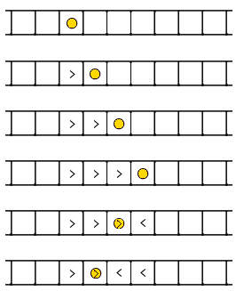

<h1 style='text-align: center;'> A. Snow Footprints</h1>

<h5 style='text-align: center;'>time limit per test: 1 second</h5>
<h5 style='text-align: center;'>memory limit per test: 256 megabytes</h5>

There is a straight snowy road, divided into *n* blocks. The blocks are numbered from 1 to *n* from left to right. If one moves from the *i*-th block to the (*i* + 1)-th block, he will leave a right footprint on the *i*-th block. Similarly, if one moves from the *i*-th block to the (*i* - 1)-th block, he will leave a left footprint on the *i*-th block. If there already is a footprint on the *i*-th block, the new footprint will cover the old one.

  At the beginning, there were no footprints. Then polar bear Alice starts from the *s*-th block, makes a sequence of moves and ends in the *t*-th block. It is known that Alice never moves outside of the road. 

You are given the description of Alice's footprints. Your task is to find a pair of possible values of *s*, *t* by looking at the footprints.

## Input

The first line of the input contains integer *n* (3 ≤ *n* ≤ 1000).

The second line contains the description of the road — the string that consists of *n* characters. Each character will be either "." (a block without footprint), or "L" (a block with a left footprint), "R" (a block with a right footprint).

It's guaranteed that the given string contains at least one character not equal to ".". Also, the first and the last character will always be ".". It's guaranteed that a solution exists.

## Output

Print two space-separated integers — the values of *s* and *t*. If there are several possible solutions you can print any of them.

## Examples

## Input


```
9  
..RRLL...  

```
## Output


```
3 4  

```
## Input


```
11  
.RRRLLLLL..  

```
## Output


```
7 5  

```
## Note

The first test sample is the one in the picture.


#### tags 

#1300 #greedy #implementation 