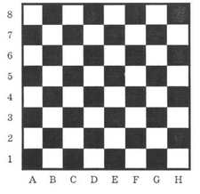

<h1 style='text-align: center;'> A. Shortest path of the king</h1>

<h5 style='text-align: center;'>time limit per test: 1 second</h5>
<h5 style='text-align: center;'>memory limit per test: 64 megabytes</h5>

The king is left alone on the chessboard. In spite of this loneliness, he doesn't lose heart, because he has business of national importance. For example, he has to pay an official visit to square *t*. As the king is not in habit of wasting his time, he wants to get from his current position *s* to square *t* in the least number of moves. Help him to do this.

  In one move the king can get to the square that has a common side or a common vertex with the square the king is currently in (generally there are 8 different squares he can move to).

## Input

The first line contains the chessboard coordinates of square *s*, the second line — of square *t*.

Chessboard coordinates consist of two characters, the first one is a lowercase Latin letter (from a to h), the second one is a digit from 1 to 8.

## Output

In the first line print *n* — minimum number of the king's moves. Then in *n* lines print the moves themselves. Each move is described with one of the 8: L, R, U, D, LU, LD, RU or RD. 

L, R, U, D stand respectively for moves left, right, up and down (according to the picture), and 2-letter combinations stand for diagonal moves. If the answer is not unique, print any of them. 

## Examples

## Input


```
a8  
h1  

```
## Output


```
7  
RD  
RD  
RD  
RD  
RD  
RD  
RD  

```


#### tags 

#1000 #greedy #shortest_paths 