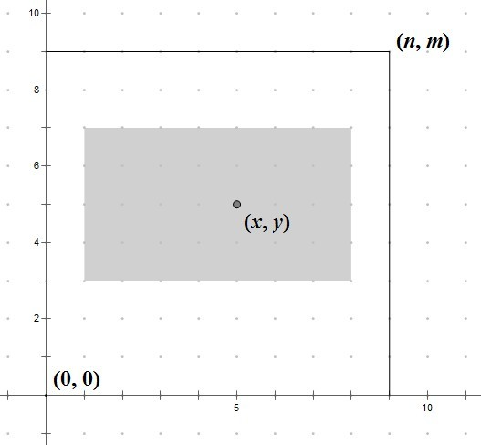

<h1 style='text-align: center;'> B. Rectangle Puzzle II</h1>

<h5 style='text-align: center;'>time limit per test: 2 seconds</h5>
<h5 style='text-align: center;'>memory limit per test: 256 megabytes</h5>

You are given a rectangle grid. That grid's size is *n* × *m*. Let's denote the coordinate system on the grid. So, each point on the grid will have coordinates — a pair of integers (*x*, *y*) (0 ≤ *x* ≤ *n*, 0 ≤ *y* ≤ *m*).

Your task is to find a maximum sub-rectangle on the grid (*x*1, *y*1, *x*2, *y*2) so that it contains the given point (*x*, *y*), and its length-width ratio is exactly (*a*, *b*). In other words the following conditions must hold: 0 ≤ *x*1 ≤ *x* ≤ *x*2 ≤ *n*, 0 ≤ *y*1 ≤ *y* ≤ *y*2 ≤ *m*, .

The sides of this sub-rectangle should be parallel to the axes. And values *x*1, *y*1, *x*2, *y*2 should be integers.

  If there are multiple solutions, find the rectangle which is closest to (*x*, *y*). Here "closest" means the Euclid distance between (*x*, *y*) and the center of the rectangle is as small as possible. If there are still multiple solutions, find the lexicographically minimum one. Here "lexicographically minimum" means that we should consider the sub-rectangle as sequence of integers (*x*1, *y*1, *x*2, *y*2), so we can choose the lexicographically minimum one.

## Input

The first line contains six integers *n*, *m*, *x*, *y*, *a*, *b* (1 ≤ *n*, *m* ≤ 109, 0 ≤ *x* ≤ *n*, 0 ≤ *y* ≤ *m*, 1 ≤ *a* ≤ *n*, 1 ≤ *b* ≤ *m*).

## Output

Print four integers *x*1, *y*1, *x*2, *y*2, which represent the founded sub-rectangle whose left-bottom point is (*x*1, *y*1) and right-up point is (*x*2, *y*2).

## Examples

## Input


```
9 9 5 5 2 1  

```
## Output


```
1 3 9 7  

```
## Input


```
100 100 52 50 46 56  

```
## Output


```
17 8 86 92  

```


#### tags 

#1700 #implementation #math 