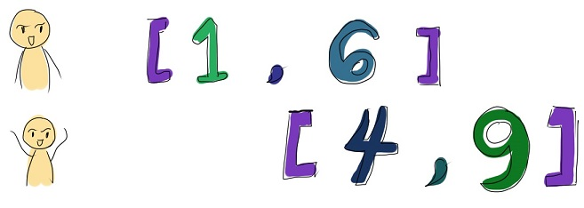

<h1 style='text-align: center;'> E. Random Ranking</h1>

<h5 style='text-align: center;'>time limit per test: 2 seconds</h5>
<h5 style='text-align: center;'>memory limit per test: 256 megabytes</h5>

Imagine a real contest or exam of *n* participants. Every participant will get a particular score. We can predict the standings board more or less, if we do some statistics on their previous performance.

  Let's say the score of the participants will be uniformly distributed in interval [*l**i*, *r**i*] (the score can be a real number). Can you predict the standings board according to these data? In other words you should say for each participant the probability that he gets some fixed place in the scoreboard. The participants are sorted by increasing of their scores in the scoreboard. So, the participant with the largest score gets the last place.

## Input

The first line contains integer *n* (1  ≤ *n*  ≤ 80), showing how many participants we have. Each of the next *n* lines contains our predictions, the *i*-th line contains a pair of integers *l**i*, *r**i* (0 ≤ *l**i* < *r**i* ≤ 109) as the distributed interval for participant *i*.

Consider the participants numbered from 1 to *n* in some way.

## Output

## Output

 a distributed matrix *a* of order *n*. The element *a**ij* of the matrix is the probability that participant *i* has rank *j*.

Your answer will considered correct if it has at most 10- 6 absolute or relative error.

## Examples

## Input


```
2  
1 6  
4 9  

```
## Output


```
0.9200000000 0.080   
0.080 0.9200000000   

```
## Input


```
8  
0 2  
1 3  
2 4  
3 5  
4 6  
5 7  
6 8  
7 9  

```
## Output


```
0.875 0.125 0 0 0 0 0 0   
0.125 0.750 0.125 0 0 0 0 0   
0 0.125 0.750 0.125 0 0 0 0   
0 0 0.125 0.750 0.125 0 0 0   
0 0 0 0.125 0.750 0.125 0 0   
0 0 0 0 0.125 0.750 0.125 0   
0 0 0 0 0 0.125 0.750 0.125   
0 0 0 0 0 0 0.125 0.875   

```
## Note

The score probability distribution is continuous, which means, there is no possibility for a draw.


#### tags 

#3000 #dp #math #probabilities 