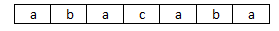
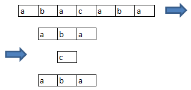

<h1 style='text-align: center;'> E. Playing with String</h1>

<h5 style='text-align: center;'>time limit per test: 2 seconds</h5>
<h5 style='text-align: center;'>memory limit per test: 256 megabytes</h5>

Two people play the following string game. Initially the players have got some string *s*. The players move in turns, the player who cannot make a move loses. 

Before the game began, the string is written on a piece of paper, one letter per cell.

  An example of the initial situation at *s* = "abacaba" A player's move is the sequence of actions:

1. The player chooses one of the available pieces of paper with some string written on it. Let's denote it is *t*. ## Note

 that initially, only one piece of paper is available.
2. The player chooses in the string *t* = *t*1*t*2... *t*|*t*| character in position *i* (1 ≤ *i* ≤ |*t*|) such that for some positive integer *l* (0 < *i* - *l*; *i* + *l* ≤ |*t*|) the following equations hold: *t**i* - 1 = *t**i* + 1, *t**i* - 2 = *t**i* + 2, ..., *t**i* - *l* = *t**i* + *l*.
3. Player cuts the cell with the chosen character. As a result of the operation, he gets three new pieces of paper, the first one will contain string *t*1*t*2... *t**i* - 1, the second one will contain a string consisting of a single character *t**i*, the third one contains string *t**i* + 1*t**i* + 2... *t*|*t*|.

  An example of making action (*i* = 4) with string *s* = «abacaba» Your task is to determine the winner provided that both players play optimally well. If the first player wins, find the position of character that is optimal to cut in his first move. If there are multiple positions, print the minimal possible one.

## Input

The first line contains string *s* (1 ≤ |*s*| ≤ 5000). It is guaranteed that string *s* only contains lowercase English letters.

## Output

If the second player wins, print in the single line "Second" (without the quotes). Otherwise, print in the first line "First" (without the quotes), and in the second line print the minimal possible winning move — integer *i* (1 ≤ *i* ≤ |*s*|).

## Examples

## Input


```
abacaba  

```
## Output


```
First  
2  

```
## Input


```
abcde  

```
## Output


```
Second  

```
## Note

In the first sample the first player has multiple winning moves. But the minimum one is to cut the character in position 2. 

In the second sample the first player has no available moves.


#### tags 

#2300 #games 