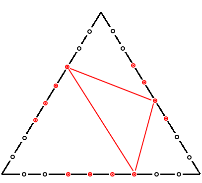

<h1 style='text-align: center;'> D. Tennis Rackets</h1>

<h5 style='text-align: center;'>time limit per test: 3 seconds</h5>
<h5 style='text-align: center;'>memory limit per test: 256 megabytes</h5>

Professional sport is more than hard work. It also is the equipment, designed by top engineers. As an example, let's take tennis. Not only should you be in great shape, you also need an excellent racket! In this problem your task is to contribute to the development of tennis and to help to design a revolutionary new concept of a racket!

The concept is a triangular racket. Ant it should be not just any triangle, but a regular one. As soon as you've chosen the shape, you need to stretch the net. By the time you came the rocket had *n* holes drilled on each of its sides. The holes divide each side into equal *n* + 1 parts. At that, the *m* closest to each apex holes on each side are made for better ventilation only and you cannot stretch the net through them. The next revolutionary idea as to stretch the net as obtuse triangles through the holes, so that for each triangle all apexes lay on different sides. Moreover, you need the net to be stretched along every possible obtuse triangle. That's where we need your help — help us to count the number of triangles the net is going to consist of.

Two triangles are considered to be different if their pictures on the fixed at some position racket are different.

## Input

The first and the only input line contains two integers *n*, *m* .

## Output

Print a single number — the answer to the problem.

## Examples

## Input


```
3 0  

```
## Output


```
9  

```
## Input


```
4 0  

```
## Output


```
24  

```
## Input


```
10 1  

```
## Output


```
210  

```
## Input


```
8 4  

```
## Output


```
0  

```
## Note

For the following picture *n* = 8, *m* = 2. White circles are the holes for ventilation, red circles — holes for net stretching. One of the possible obtuse triangles is painted red. 

  

#### tags 

#2700 #brute_force #geometry 