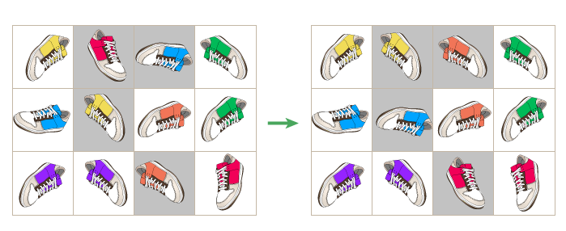

<h1 style='text-align: center;'> C1. Tidying Up</h1>

<h5 style='text-align: center;'>time limit per test: 4 seconds</h5>
<h5 style='text-align: center;'>memory limit per test: 256 megabytes</h5>

Smart Beaver is careful about his appearance and pays special attention to shoes so he has a huge number of pairs of shoes from the most famous brands of the forest. He's trying to handle his shoes carefully so that each pair stood side by side. But by the end of the week because of his very active lifestyle in his dressing room becomes a mess.

Smart Beaver from ABBYY is not only the brightest beaver in the area, but he also is the most domestically oriented. For example, on Mondays the Smart Beaver cleans everything in his home.

It's Monday morning. Smart Beaver does not want to spend the whole day cleaning, besides, there is much in to do and it’s the gym day, so he wants to clean up as soon as possible. Now the floors are washed, the dust is wiped off — it’s time to clean up in the dressing room. But as soon as the Smart Beaver entered the dressing room, all plans for the day were suddenly destroyed: chaos reigned there and it seemed impossible to handle, even in a week. Give our hero some hope: tell him what is the minimum number of shoes need to change the position to make the dressing room neat.

The dressing room is rectangular and is divided into *n* × *m* equal squares, each square contains exactly one shoe. Each pair of shoes has a unique number that is integer from 1 to , more formally, a square with coordinates (*i*, *j*) contains an integer number of the pair which is lying on it. The Smart Beaver believes that the dressing room is neat only when each pair of sneakers lies together. We assume that the pair of sneakers in squares (*i*1, *j*1) and (*i*2, *j*2) lies together if |*i*1 - *i*2| + |*j*1 - *j*2| = 1.

## Input

The first line contains two space-separated integers *n* and *m*. They correspond to the dressing room size. Next *n* lines contain *m* space-separated integers each. Those numbers describe the dressing room. Each number corresponds to a snicker. 

It is guaranteed that: 

* *n*·*m* is even.
* All numbers, corresponding to the numbers of pairs of shoes in the dressing room, will lie between 1 and .
* Each number from 1 to  will occur exactly twice.

The input limits for scoring 30 points are (subproblem C1): 

* 2 ≤ *n*, *m* ≤ 8.

The input limits for scoring 100 points are (subproblems C1+C2): 

* 2 ≤ *n*, *m* ≤ 80.
## Output

Print exactly one integer — the minimum number of the sneakers that need to change their location.

## Examples

## Input


```
2 3  
1 1 2  
2 3 3  

```
## Output


```
2  

```
## Input


```
3 4  
1 3 2 6  
2 1 5 6  
4 4 5 3  

```
## Output


```
4  

```
## Note

   The second sample.  

#### tags 

#2200 #flows 