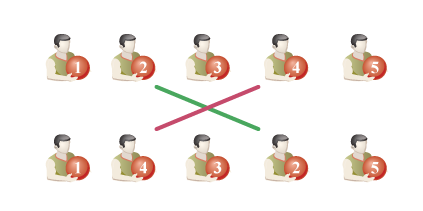

<h1 style='text-align: center;'> D2. PE Lesson</h1>

<h5 style='text-align: center;'>time limit per test: 3 seconds</h5>
<h5 style='text-align: center;'>memory limit per test: 256 megabytes</h5>

Smart Beaver decided to be not only smart, but also a healthy beaver! And so he began to attend physical education classes at school X. In this school, physical education has a very creative teacher. One of his favorite warm-up exercises is throwing balls. Students line up. Each one gets a single ball in the beginning. The balls are numbered from 1 to *n* (by the demand of the inventory commission).

   Figure 1. The initial position for *n* = 5.  After receiving the balls the students perform the warm-up exercise. The exercise takes place in a few throws. For each throw the teacher chooses any two arbitrary different students who will participate in it. The selected students throw their balls to each other. Thus, after each throw the students remain in their positions, and the two balls are swapped.

   Figure 2. The example of a throw.  In this case there was a throw between the students, who were holding the 2-nd and the 4-th balls. Since the warm-up has many exercises, each of them can only continue for little time. Therefore, for each student we know the maximum number of throws he can participate in. For this lessons maximum number of throws will be 1 or 2.

Note that after all phases of the considered exercise any ball can end up with any student. Smart Beaver decided to formalize it and introduced the concept of the "ball order". The ball order is a sequence of *n* numbers that correspond to the order of balls in the line. The first number will match the number of the ball of the first from the left student in the line, the second number will match the ball of the second student, and so on. For example, in figure 2 the order of the balls was (1, 2, 3, 4, 5), and after the throw it was (1, 4, 3, 2, 5). Smart beaver knows the number of students and for each student he knows the maximum number of throws in which he can participate. And now he is wondering: what is the number of distinct ways of ball orders by the end of the exercise.

## Input

The first line contains a single number *n* — the number of students in the line and the number of balls. The next line contains exactly *n* space-separated integers. Each number corresponds to a student in the line (the *i*-th number corresponds to the *i*-th from the left student in the line) and shows the number of throws he can participate in.

The input limits for scoring 30 points are (subproblem D1): 

* 1 ≤ *n* ≤ 10.

The input limits for scoring 70 points are (subproblems D1+D2): 

* 1 ≤ *n* ≤ 500.

The input limits for scoring 100 points are (subproblems D1+D2+D3): 

* 1 ≤ *n* ≤ 1000000.
## Output

The output should contain a single integer — the number of variants of ball orders after the warm up exercise is complete. As the number can be rather large, print it modulo 1000000007 (109 + 7).

## Examples

## Input


```
5  
1 2 2 1 2  

```
## Output


```
120  

```
## Input


```
8  
1 2 2 1 2 1 1 2  

```
## Output


```
16800  

```


#### tags 

#2300 #dp 