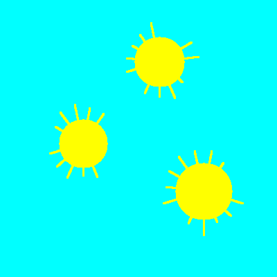
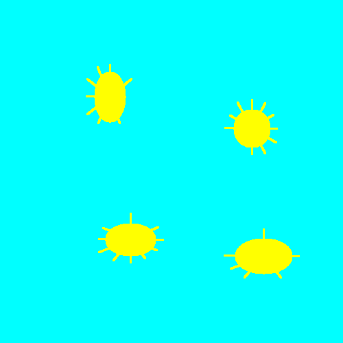
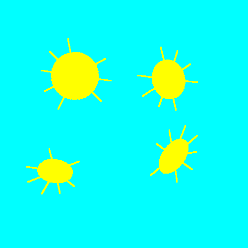

<h1 style='text-align: center;'> F2. Suns and Rays</h1>

<h5 style='text-align: center;'>time limit per test: 3 seconds</h5>
<h5 style='text-align: center;'>memory limit per test: 256 megabytes</h5>

Smart Beaver became interested in drawing. He draws suns. However, at some point, Smart Beaver realized that simply drawing suns is boring. So he decided to design a program that will process his drawings. You are given a picture drawn by the beaver. It will have two colors: one for the background and one for the suns in the image. Your task will be to count the number of suns in the image and for each of them to count the number of rays.

Sun is arbitrarily rotated ellipse with rays. Ray is a segment which connects point on boundary of the ellipse with some point outside ellipse.

   An image where all suns are circles.     An image where all suns are ellipses, their axes are parallel to the coordinate axes.     An image where all suns are rotated ellipses.  It is guaranteed that: 

* No two suns have common points.
* The rays’ width is 3 pixels.
* The lengths of the ellipsis suns’ axes will lie between 40 and 200 pixels.
* No two rays intersect.
* The lengths of all rays will lie between 10 and 30 pixels.
## Input

The first line contains two integers *h* and *w* — the height and width of the image (1 ≤ *h*, *w* ≤ 1600). Next *h* lines will contain *w* space-separated integers each. They describe Smart Beaver’s picture. Each number equals either a 0 (the image background), or a 1 (the sun color).

The input limits for scoring 30 points are (subproblem F1): 

* All suns on the image are circles.

The input limits for scoring 70 points are (subproblems F1+F2): 

* All suns on the image are ellipses with axes parallel to the coordinate axes.

The input limits for scoring 100 points are (subproblems F1+F2+F3):

* All suns on the image are ellipses, they can be arbitrarily rotated.
## Output

The first line must contain a single number *k* — the number of suns on the beaver’s image. The second line must contain exactly *k* space-separated integers, corresponding to the number of rays on each sun. The numbers of the second line must be sorted in the increasing order.

## Examples

## Note

For each complexity level you are suggested a sample in the initial data. You can download the samples at http://www.abbyy.ru/sun.zip.

 

#### tags 

#2300 