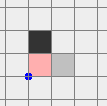

<h1 style='text-align: center;'> E. Princess and Her Shadow</h1>

<h5 style='text-align: center;'>time limit per test: 1 second</h5>
<h5 style='text-align: center;'>memory limit per test: 256 megabytes</h5>

Princess Vlada enjoys springing in the meadows and walking in the forest. One day — wonderful, sunny day — during her walk Princess found out with astonishment that her shadow was missing! "Blimey!", — she thought and started her search of the shadow in the forest.

Normally the Shadow is too lazy and simply sleeps under the Princess. But at this terrifically hot summer day she got bored of such a dull life, so she decided to play with Vlada.

The forest, where our characters entertain themselves, may be represented as a set of integer cells in the plane, where the Shadow and the Princess can move only up, down, left and right by 1. Some cells (as it happens in decent forests) are occupied by trees. The Shadow and the Princess are not allowed to enter a cell occupied by a tree. Unfortunately, these are the hard times for the forest, so there are very few trees growing here...

At first the Princess was walking within the cell (*v**x*, *v**y*), while the Shadow hid from the Princess in the cell (*s**x*, *s**y*). The Princess, The Shadow and the trees are located in the different cells.

The Shadow is playing with the Princess. As soon as the Princess moves by 1 in some direction, the Shadow simultaneously flies by 1 in the same direction, if it is possible (if the cell to fly to is not occupied by some tree); otherwise, the Shadow doesn't move. The Shadow is very shadowy, so our characters do not interfere with each other.

We say that the Shadow is caught by the Princess if after some move both of them are located in the same cell. Vlada managed to catch her Shadow! Can you?

## Input

First line of the input contains the coordinates of the characters *v**x*, *v**y*, *s**x*, *s**y* and the number of trees *m* (0 ≤ *m* ≤ 400). The following *m* lines contain the coordinates of the trees.

All the coordinates are integers between -100 and 100, inclusive. The Princess, The Shadow and the trees are located in the different cells.

## Output

If it is impossible for the Princess to catch the Shadow, print "-1" (without quotes).

Otherwise print a sequence of characters "L", "R", "D", "U", corresponding to the Princess's moves, following which she will be able to catch the Shadow at some turn (L — move to the left, R — to the right, U — up, D — down; axis *x* is directed to the right, *y* — up).

The number of characters (that is, the number of moves) must not exceed 106. All the Princess's moves should be correct, that is must not lead to the cell where a tree grows. It is allowed for the Princess and the Shadow to occupy the same cell before the last turn.

## Examples

## Input


```
0 0 1 0 1  
0 1  

```
## Output


```
LLUR  

```
## Input


```
5 0 3 0 8  
2 -1  
2 0  
2 1  
3 -1  
4 1  
4 0  
3 1  
4 -1  

```
## Output


```
-1  

```
## Input


```
3 2 1 1 3  
0 1  
1 0  
0 0  

```
## Output


```
DLL
```
## Note

Below the pictures for the samples are given (Princess, Shadow and the trees are colored in pink, gray and black correspondingly; the blue dot marks the lattice center).

In the first case the Princess may make two left steps, one step upwards and one right step: 

In the following case the Princess cannot catch the Shadow: 

In the last sample the Princess may make two left steps and one down step (in any order): 


#### tags 

#3100 #constructive_algorithms #shortest_paths 