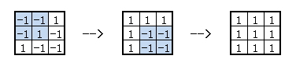

<h1 style='text-align: center;'> D. Ciel and Flipboard</h1>

<h5 style='text-align: center;'>time limit per test: 4 seconds</h5>
<h5 style='text-align: center;'>memory limit per test: 256 megabytes</h5>

Fox Ciel has a board with *n* rows and *n* columns, there is one integer in each cell.

It's known that *n* is an odd number, so let's introduce . Fox Ciel can do the following operation many times: she choose a sub-board with size *x* rows and *x* columns, then all numbers in it will be multiplied by -1.

Return the maximal sum of numbers in the board that she can get by these operations.

## Input

The first line contains an integer *n*, (1 ≤ *n* ≤ 33, and *n* is an odd integer) — the size of the board.

Each of the next *n* lines contains *n* integers — the numbers in the board. Each number doesn't exceed 1000 by its absolute value.

## Output

## Output

 a single integer: the maximal sum of numbers in the board that can be accomplished.

## Examples

## Input


```
3  
-1 -1 1  
-1 1 -1  
1 -1 -1  

```
## Output


```
9  

```
## Input


```
5  
-2 0 0 0 -2  
0 -2 0 -2 0  
0 0 -2 0 0  
0 -2 0 -2 0  
-2 0 0 0 -2  

```
## Output


```
18  

```
## Note

In the first test, we can apply this operation twice: first on the top left 2 × 2 sub-board, then on the bottom right 2 × 2 sub-board. Then all numbers will become positive.




#### tags 

#2900 #dp #greedy #math 