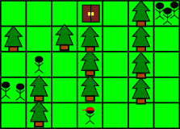
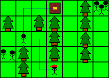
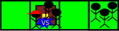

<h1 style='text-align: center;'> B. Biridian Forest</h1>

<h5 style='text-align: center;'>time limit per test: 2 seconds</h5>
<h5 style='text-align: center;'>memory limit per test: 256 megabytes</h5>

You're a mikemon breeder currently in the middle of your journey to become a mikemon master. Your current obstacle is go through the infamous Biridian Forest.

The forest

The Biridian Forest is a two-dimensional grid consisting of *r* rows and *c* columns. Each cell in Biridian Forest may contain a tree, or may be vacant. A vacant cell may be occupied by zero or more mikemon breeders (there may also be breeders other than you in the forest). Mikemon breeders (including you) cannot enter cells with trees. One of the cells is designated as the exit cell.

The initial grid, including your initial position, the exit cell, and the initial positions of all other breeders, will be given to you. Here's an example of such grid (from the first example):

  Moves

Breeders (including you) may move in the forest. In a single move, breeders may perform one of the following actions: 

* Do nothing.
* Move from the current cell to one of the four adjacent cells (two cells are adjacent if they share a side). ## Note

 that breeders cannot enter cells with trees.
* If you are located on the exit cell, you may leave the forest. Only you can perform this move — all other mikemon breeders will never leave the forest by using this type of movement.

After each time you make a single move, each of the other breeders simultaneously make a single move (the choice of which move to make may be different for each of the breeders).

Mikemon battle

If you and *t* (*t* > 0) mikemon breeders are located on the same cell, exactly *t* mikemon battles will ensue that time (since you will be battling each of those *t* breeders once). After the battle, all of those *t* breeders will leave the forest to heal their respective mikemons.

## Note

 that the moment you leave the forest, no more mikemon battles can ensue, even if another mikemon breeder move to the exit cell immediately after that. Also note that a battle only happens between you and another breeders — there will be no battle between two other breeders (there may be multiple breeders coexisting in a single cell).

Your goal

You would like to leave the forest. In order to do so, you have to make a sequence of moves, ending with a move of the final type. Before you make any move, however, you post this sequence on your personal virtual idol Blog. Then, you will follow this sequence of moves faithfully.

Goal of other breeders

Because you post the sequence in your Blog, the other breeders will all know your exact sequence of moves even before you make your first move. All of them will move in such way that will guarantee a mikemon battle with you, if possible. The breeders that couldn't battle you will do nothing.

Your task

Print the minimum number of mikemon battles that you must participate in, assuming that you pick the sequence of moves that minimize this number. ## Note

 that you are not required to minimize the number of moves you make.

## Input

The first line consists of two integers: *r* and *c* (1 ≤ *r*, *c* ≤ 1000), denoting the number of rows and the number of columns in Biridian Forest. The next *r* rows will each depict a row of the map, where each character represents the content of a single cell: 

* 'T': A cell occupied by a tree.
* 'S': An empty cell, and your starting position. There will be exactly one occurence of this in the map.
* 'E': An empty cell, and where the exit is located. There will be exactly one occurence of this in the map.
* A digit (0-9): A cell represented by a digit X means that the cell is empty and is occupied by X breeders (in particular, if X is zero, it means that the cell is not occupied by any breeder).

It is guaranteed that it will be possible for you to go from your starting position to the exit cell through a sequence of moves.

## Output

A single line denoted the minimum possible number of mikemon battles that you have to participate in if you pick a strategy that minimize this number.

## Examples

## Input


```
5 7  
000E0T3  
T0TT0T0  
010T0T0  
2T0T0T0  
0T0S000  

```
## Output


```
3  

```
## Input


```
1 4  
SE23  

```
## Output


```
2  

```
## Note

The following picture illustrates the first example. The blue line denotes a possible sequence of moves that you should post in your blog:

  The three breeders on the left side of the map will be able to battle you — the lone breeder can simply stay in his place until you come while the other two breeders can move to where the lone breeder is and stay there until you come. The three breeders on the right does not have a way to battle you, so they will stay in their place.

For the second example, you should post this sequence in your Blog:

  Here's what happens. First, you move one cell to the right.

  Then, the two breeders directly to the right of the exit will simultaneously move to the left. The other three breeder cannot battle you so they will do nothing.

  You end up in the same cell with 2 breeders, so 2 mikemon battles are conducted. After those battles, all of your opponents leave the forest.

  Finally, you make another move by leaving the forest.

  

#### tags 

#1500 #dfs_and_similar #shortest_paths 