<h1 style='text-align: center;'> D. The Evil Temple and the Moving Rocks</h1>

<h5 style='text-align: center;'>time limit per test: 2 seconds</h5>
<h5 style='text-align: center;'>memory limit per test: 256 megabytes</h5>

Important: All possible tests are in the pretest, so you shouldn't hack on this problem. So, if you passed pretests, you will also pass the system test.

You are an adventurer currently journeying inside an evil temple. After defeating a couple of weak monsters, you arrived at a square room consisting of tiles forming an *n* × *n* grid, surrounded entirely by walls. At the end of the room lies a door locked with evil magical forces. The following inscriptions are written on the door:

 The sound of clashing rocks will awaken the door! Being a very senior adventurer, you immediately realize what this means. In the room next door lies an infinite number of magical rocks. There are four types of rocks: 

* '^': this rock moves upwards;
* '<': this rock moves leftwards;
* '>': this rock moves rightwards;
* 'v': this rock moves downwards.

To open the door, you first need to place the rocks on some of the tiles (one tile can be occupied by at most one rock). Then, you select a single rock that you have placed and activate it. The activated rock will then move in its direction until it hits another rock or hits the walls of the room (the rock will not move if something already blocks it in its chosen direction). The rock then deactivates. If it hits the walls, or if there have been already 107 events of rock becoming activated, the movements end. Otherwise, the rock that was hit becomes activated and this procedure is repeated.

If a rock moves at least one cell before hitting either the wall or another rock, the hit produces a sound. The door will open once the number of produced sounds is at least *x*. It is okay for the rocks to continue moving after producing *x* sounds.

The following picture illustrates the four possible scenarios of moving rocks.

* Moves at least one cell, then hits another rock. A sound is produced, the hit rock becomes activated. 
* Moves at least one cell, then hits the wall (i.e., the side of the room). A sound is produced, the movements end. 
* Does not move because a rock is already standing in the path. The blocking rock becomes activated, but no sounds are produced. 
* Does not move because the wall is in the way. No sounds are produced and the movements end. 

Assume there's an infinite number of rocks of each type in the neighboring room. You know what to do: place the rocks and open the door!

## Input

The first line will consists of two integers *n* and *x*, denoting the size of the room and the number of sounds required to open the door. There will be exactly three test cases for this problem:

* *n* = 5, *x* = 5;
* *n* = 3, *x* = 2;
* *n* = 100, *x* = 105.

All of these testcases are in pretest.

## Output

## Output

 *n* lines. Each line consists of *n* characters — the *j*-th character of the *i*-th line represents the content of the tile at the *i*-th row and the *j*-th column, and should be one of these:

* '^', '<', '>', or 'v': a rock as described in the problem statement.
* '.': an empty tile.

Then, output two integers *r* and *c* (1 ≤ *r*, *c* ≤ *n*) on the next line — this means that the rock you activate first is located at the *r*-th row from above and *c*-th column from the left. There must be a rock in this cell.

If there are multiple solutions, you may output any of them.

## Examples

## Input


```
5 5  

```
## Output


```
>...v  
v.<..  
..^..  
>....  
..^.<  
1 1  

```
## Input


```
3 2  

```
## Output


```
>vv  
^<.  
^.<  
1 3  

```
## Note

Here's a simulation of the first example, accompanied with the number of sounds produced so far.

 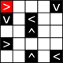 0 sound  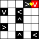 1 sound  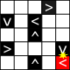 2 sounds  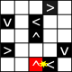 3 sounds  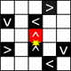 4 sounds  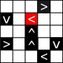 still 4 sounds In the picture above, the activated rock switches between the '^' rock and the '<' rock. However, no sound is produced since the '^' rock didn't move even a single tile. So, still 4 sound.

 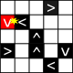 5 sounds At this point, 5 sound are already produced, so this solution is already correct. However, for the sake of example, we will continue simulating what happens.

 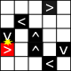 6 sounds  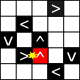 7 sounds  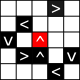 still 7 sounds  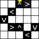 8 sounds And the movement stops. In total, it produces 8 sounds. Notice that the last move produced sound.

Here's a simulation of the second example:

 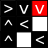 0 sound   1 sound  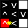 2 sounds Now, the activated stone will switch continuously from one to another without producing a sound until it reaches the 107 limit, after which the movement will cease.

 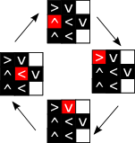 In total, it produced exactly 2 sounds, so the solution is correct.


#### tags 

#2500 #constructive_algorithms 