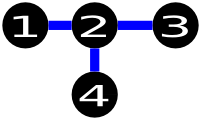
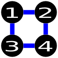
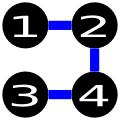
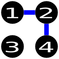

<h1 style='text-align: center;'> B. Road Construction</h1>

<h5 style='text-align: center;'>time limit per test: 2 seconds</h5>
<h5 style='text-align: center;'>memory limit per test: 256 megabytes</h5>

A country has *n* cities. Initially, there is no road in the country. One day, the king decides to construct some roads connecting pairs of cities. Roads can be traversed either way. He wants those roads to be constructed in such a way that it is possible to go from each city to any other city by traversing at most two roads. You are also given *m* pairs of cities — roads cannot be constructed between these pairs of cities.

Your task is to construct the minimum number of roads that still satisfy the above conditions. The constraints will guarantee that this is always possible.

## Input

The first line consists of two integers *n* and *m* .

Then *m* lines follow, each consisting of two integers *a**i* and *b**i* (1 ≤ *a**i*, *b**i* ≤ *n*, *a**i* ≠ *b**i*), which means that it is not possible to construct a road connecting cities *a**i* and *b**i*. Consider the cities are numbered from 1 to *n*.

It is guaranteed that every pair of cities will appear at most once in the input.

## Output

You should print an integer *s*: the minimum number of roads that should be constructed, in the first line. Then *s* lines should follow, each consisting of two integers *a**i* and *b**i* (1 ≤ *a**i*, *b**i* ≤ *n*, *a**i* ≠ *b**i*), which means that a road should be constructed between cities *a**i* and *b**i*.

If there are several solutions, you may print any of them.

## Examples

## Input


```
4 1  
1 3  

```
## Output


```
3  
1 2  
4 2  
2 3  

```
## Note

This is one possible solution of the example: 

  These are examples of wrong solutions:

   The above solution is wrong because it doesn't use the minimum number of edges (4 vs 3). In addition, it also tries to construct a road between cities 1 and 3, while the input specifies that it is not allowed to construct a road between the pair.   The above solution is wrong because you need to traverse at least 3 roads to go from city 1 to city 3, whereas in your country it must be possible to go from any city to another by traversing at most 2 roads.   Finally, the above solution is wrong because it must be possible to go from any city to another, whereas it is not possible in this country to go from city 1 to 3, 2 to 3, and 4 to 3.

#### tags 

#1300 #constructive_algorithms #graphs 