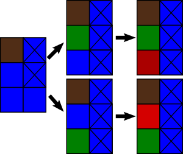
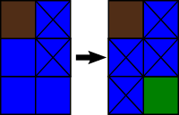

<h1 style='text-align: center;'> C. More Reclamation</h1>

<h5 style='text-align: center;'>time limit per test: 2 seconds</h5>
<h5 style='text-align: center;'>memory limit per test: 256 megabytes</h5>

In a far away land, there are two cities near a river. One day, the cities decide that they have too little space and would like to reclaim some of the river area into land.

The river area can be represented by a grid with *r* rows and exactly two columns — each cell represents a rectangular area. The rows are numbered 1 through *r* from top to bottom, while the columns are numbered 1 and 2.

Initially, all of the cells are occupied by the river. The plan is to turn some of those cells into land one by one, with the cities alternately choosing a cell to reclaim, and continuing until no more cells can be reclaimed.

However, the river is also used as a major trade route. The cities need to make sure that ships will still be able to sail from one end of the river to the other. More formally, if a cell (*r*, *c*) has been reclaimed, it is not allowed to reclaim any of the cells (*r* - 1, 3 - *c*), (*r*, 3 - *c*), or (*r* + 1, 3 - *c*).

The cities are not on friendly terms, and each city wants to be the last city to reclaim a cell (they don't care about how many cells they reclaim, just who reclaims a cell last). The cities have already reclaimed *n* cells. Your job is to determine which city will be the last to reclaim a cell, assuming both choose cells optimally from current moment.

## Input

The first line consists of two integers *r* and *n* (1 ≤ *r* ≤ 100, 0 ≤ *n* ≤ *r*). Then *n* lines follow, describing the cells that were already reclaimed. Each line consists of two integers: *r**i* and *c**i* (1 ≤ *r**i* ≤ *r*, 1 ≤ *c**i* ≤ 2), which represent the cell located at row *r**i* and column *c**i*. All of the lines describing the cells will be distinct, and the reclaimed cells will not violate the constraints above.

## Output

## Output

 "WIN" if the city whose turn it is to choose a cell can guarantee that they will be the last to choose a cell. Otherwise print "LOSE".

## Examples

## Input


```
3 1  
1 1  

```
## Output


```
WIN  

```
## Input


```
12 2  
4 1  
8 1  

```
## Output


```
WIN  

```
## Input


```
1 1  
1 2  

```
## Output


```
LOSE  

```
## Note

In the first example, there are 3 possible cells for the first city to reclaim: (2, 1), (3, 1), or (3, 2). The first two possibilities both lose, as they leave exactly one cell for the other city.

  However, reclaiming the cell at (3, 2) leaves no more cells that can be reclaimed, and therefore the first city wins.

  In the third example, there are no cells that can be reclaimed.


#### tags 

#2100 #games 