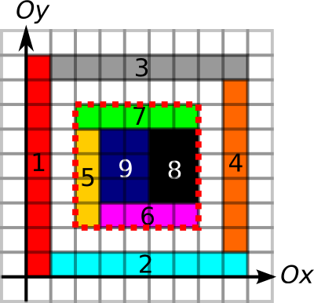
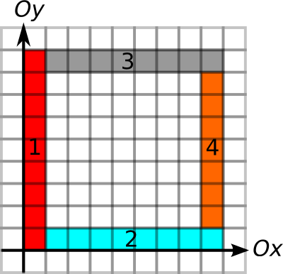

<h1 style='text-align: center;'> D. Rectangles and Square</h1>

<h5 style='text-align: center;'>time limit per test: 3 seconds</h5>
<h5 style='text-align: center;'>memory limit per test: 512 megabytes</h5>

You are given *n* rectangles, labeled 1 through *n*. The corners of rectangles have integer coordinates and their edges are parallel to the *Ox* and *Oy* axes. The rectangles may touch each other, but they do not overlap (that is, there are no points that belong to the interior of more than one rectangle).

Your task is to determine if there's a non-empty subset of the rectangles that forms a square. That is, determine if there exists a subset of the rectangles and some square for which every point that belongs to the interior or the border of that square belongs to the interior or the border of at least one of the rectangles in the subset, and every point that belongs to the interior or the border of at least one rectangle in the subset belongs to the interior or the border of that square.

## Input

First line contains a single integer *n* (1 ≤ *n* ≤ 105) — the number of rectangles. Each of the next *n* lines contains a description of a rectangle, with the *i*-th such line describing the rectangle labeled *i*. Each rectangle description consists of four integers: *x*1, *y*1, *x*2, *y*2 — coordinates of the bottom left and the top right corners (0 ≤ *x*1 < *x*2 ≤ 3000, 0 ≤ *y*1 < *y*2 ≤ 3000).

No two rectangles overlap (that is, there are no points that belong to the interior of more than one rectangle).

## Output

If such a subset exists, print "YES" (without quotes) on the first line of the output file, followed by *k*, the number of rectangles in the subset. On the second line print *k* numbers — the labels of rectangles in the subset in any order. If more than one such subset exists, print any one. If no such subset exists, print "NO" (without quotes).

## Examples

## Input


```
9  
0 0 1 9  
1 0 9 1  
1 8 9 9  
8 1 9 8  
2 2 3 6  
3 2 7 3  
2 6 7 7  
5 3 7 6  
3 3 5 6  

```
## Output


```
YES 5  
5 6 7 8 9  

```
## Input


```
4  
0 0 1 9  
1 0 9 1  
1 8 9 9  
8 1 9 8  

```
## Output


```
NO  

```
## Note

The first test case looks as follows:

  ## Note

 that rectangles 6, 8, and 9 form a square as well, and would be an acceptable answer.

The second test case looks as follows:

  

#### tags 

#2400 #brute_force #dp 