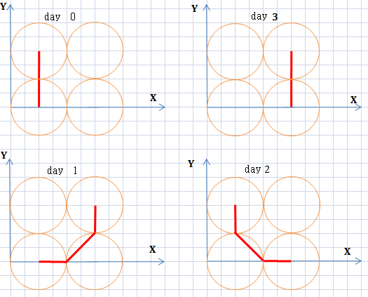

<h1 style='text-align: center;'> B. Vasily the Bear and Fly</h1>

<h5 style='text-align: center;'>time limit per test: 1 second</h5>
<h5 style='text-align: center;'>memory limit per test: 256 megabytes</h5>

One beautiful day Vasily the bear painted 2*m* circles of the same radius *R* on a coordinate plane. Circles with numbers from 1 to *m* had centers at points (2*R* - *R*, 0), (4*R* - *R*, 0), ..., (2*Rm* - *R*, 0), respectively. Circles with numbers from *m* + 1 to 2*m* had centers at points (2*R* - *R*, 2*R*), (4*R* - *R*, 2*R*), ..., (2*Rm* - *R*, 2*R*), respectively. 

Naturally, the bear painted the circles for a simple experiment with a fly. The experiment continued for *m*2 days. Each day of the experiment got its own unique number from 0 to *m*2 - 1, inclusive. 

On the day number *i* the following things happened: 

1. The fly arrived at the coordinate plane at the center of the circle with number  ( is the result of dividing number *x* by number *y*, rounded down to an integer).
2. The fly went along the coordinate plane to the center of the circle number  ( is the remainder after dividing number *x* by number *y*). The bear noticed that the fly went from the center of circle *v* to the center of circle *u* along the shortest path with all points lying on the border or inside at least one of the 2*m* circles. After the fly reached the center of circle *u*, it flew away in an unknown direction.

Help Vasily, count the average distance the fly went along the coordinate plane during each of these *m*2 days.

## Input

The first line contains two integers *m*, *R* (1 ≤ *m* ≤ 105, 1 ≤ *R* ≤ 10).

## Output

In a single line print a single real number — the answer to the problem. The answer will be considered correct if its absolute or relative error doesn't exceed 10- 6.

## Examples

## Input


```
1 1  

```
## Output


```
2.0000000000  

```
## Input


```
2 2  

```
## Output


```
5.4142135624  

```
## Note



Figure to the second sample


#### tags 

#1900 #math 