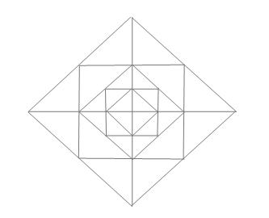

<h1 style='text-align: center;'> E. Vasily the Bear and Painting Square</h1>

<h5 style='text-align: center;'>time limit per test: 2 seconds</h5>
<h5 style='text-align: center;'>memory limit per test: 256 megabytes</h5>

Vasily the bear has two favorite integers *n* and *k* and a pencil. Besides, he's got *k* jars with different water color paints. All jars are numbered in some manner from 1 to *k*, inclusive. The jar number *i* contains the paint of the *i*-th color. 

Initially the bear took a pencil and drew four segments on the coordinate plane. All of them end at point (0, 0). They begin at: (0, 2*n*), (0,  - 2*n*), (2*n*, 0), ( - 2*n*, 0). Then for each *i* = 1, 2, ..., *n*, the bear drew two squares. The first square has the following vertex coordinates: (2*i*, 0), ( - 2*i*, 0), (0,  - 2*i*), (0, 2*i*). The second square has the following vertex coordinates: ( - 2*i* - 1,  - 2*i* - 1), ( - 2*i* - 1, 2*i* - 1), (2*i* - 1,  - 2*i* - 1), (2*i* - 1, 2*i* - 1). After that, the bear drew another square: (1, 0), ( - 1, 0), (0,  - 1), (0, 1). All points mentioned above form the set of points *A*.


The sample of the final picture at *n* = 0



The sample of the final picture at *n* = 2

The bear decided to paint the resulting picture in *k* moves. The *i*-th move consists of the following stages: 

1. The bear chooses 3 distinct points in set *А* so that any pair of the chosen points has a segment on the picture between them. The chosen points and segments mark the area that mustn't contain any previously painted points.
2. The bear paints the area bounded by the chosen points and segments the *i*-th color.

Note that after the *k*-th move some parts of the picture can stay unpainted.

The bear asked you to calculate, how many distinct ways there are to paint his picture. A way to paint the picture is a sequence of three-element sets of points he chose on each step. Two sequences are considered distinct if there is such number *i* (1 ≤ *i* ≤ *k*), that the *i*-th members of these sequences do not coincide as sets. As the sought number can be rather large, you only need to calculate the remainder after dividing it by number 1000000007 (109 + 7).

## Input

The first line contains two integers *n* and *k*, separated by a space (0 ≤ *n*, *k* ≤ 200).

## Output

Print exactly one integer — the answer to the problem modulo 1000000007 (109 + 7).

## Examples

## Input


```
0 0  

```
## Output


```
1  

```
## Input


```
0 1  

```
## Output


```
8  

```
## Input


```
0 2  

```
## Output


```
32  

```
## Input


```
1 1  

```
## Output


```
32  

```


#### tags 

#2700 #bitmasks #combinatorics #dp #implementation 