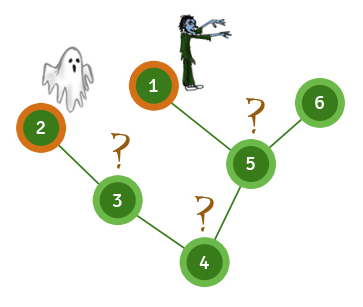

<h1 style='text-align: center;'> D. Book of Evil</h1>

<h5 style='text-align: center;'>time limit per test: 2 seconds</h5>
<h5 style='text-align: center;'>memory limit per test: 256 megabytes</h5>

Paladin Manao caught the trail of the ancient Book of Evil in a swampy area. This area contains *n* settlements numbered from 1 to *n*. Moving through the swamp is very difficult, so people tramped exactly *n* - 1 paths. Each of these paths connects some pair of settlements and is bidirectional. Moreover, it is possible to reach any settlement from any other one by traversing one or several paths.

The distance between two settlements is the minimum number of paths that have to be crossed to get from one settlement to the other one. Manao knows that the Book of Evil has got a damage range *d*. This means that if the Book of Evil is located in some settlement, its damage (for example, emergence of ghosts and werewolves) affects other settlements at distance *d* or less from the settlement where the Book resides.

Manao has heard of *m* settlements affected by the Book of Evil. Their numbers are *p*1, *p*2, ..., *p**m*. ## Note

 that the Book may be affecting other settlements as well, but this has not been detected yet. Manao wants to determine which settlements may contain the Book. Help him with this difficult task.

## Input

The first line contains three space-separated integers *n*, *m* and *d* (1 ≤ *m* ≤ *n* ≤ 100000; 0 ≤ *d* ≤ *n* - 1). The second line contains *m* distinct space-separated integers *p*1, *p*2, ..., *p**m* (1 ≤ *p**i* ≤ *n*). Then *n* - 1 lines follow, each line describes a path made in the area. A path is described by a pair of space-separated integers *a**i* and *b**i* representing the ends of this path.

## Output

Print a single number — the number of settlements that may contain the Book of Evil. It is possible that Manao received some controversial information and there is no settlement that may contain the Book. In such case, print 0.

## Examples

## Input


```
6 2 3  
1 2  
1 5  
2 3  
3 4  
4 5  
5 6  

```
## Output


```
3  

```
## Note

Sample 1. The damage range of the Book of Evil equals 3 and its effects have been noticed in settlements 1 and 2. Thus, it can be in settlements 3, 4 or 5.

  

#### tags 

#2000 #dfs_and_similar #divide_and_conquer #dp #trees 