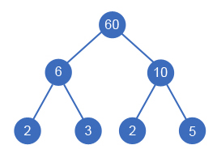
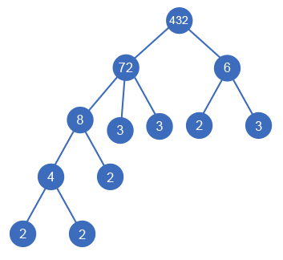

<h1 style='text-align: center;'> E. Divisor Tree</h1>

<h5 style='text-align: center;'>time limit per test: 0.5 seconds</h5>
<h5 style='text-align: center;'>memory limit per test: 256 megabytes</h5>

A divisor tree is a rooted tree that meets the following conditions: 

* Each vertex of the tree contains a positive integer number.
* The numbers written in the leaves of the tree are prime numbers.
* For any inner vertex, the number within it is equal to the product of the numbers written in its children.

Manao has *n* distinct integers *a*1, *a*2, ..., *a**n*. He tries to build a divisor tree which contains each of these numbers. That is, for each *a**i*, there should be at least one vertex in the tree which contains *a**i*. Manao loves compact style, but his trees are too large. Help Manao determine the minimum possible number of vertices in the divisor tree sought.

## Input

The first line contains a single integer *n* (1 ≤ *n* ≤ 8). The second line contains *n* distinct space-separated integers *a**i* (2 ≤ *a**i* ≤ 1012).

## Output

Print a single integer — the minimum number of vertices in the divisor tree that contains each of the numbers *a**i*.

## Examples

## Input


```
2  
6 10  

```
## Output


```
7  

```
## Input


```
4  
6 72 8 4  

```
## Output


```
12  

```
## Input


```
1  
7  

```
## Output


```
1  

```
## Note

Sample 1. The smallest divisor tree looks this way: 

Sample 2. In this case you can build the following divisor tree: 

Sample 3. ## Note

 that the tree can consist of a single vertex.


#### tags 

#2200 #brute_force #number_theory #trees 