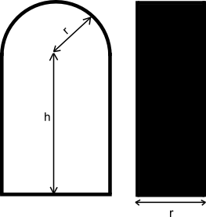

<h1 style='text-align: center;'> C. Cupboard and Balloons</h1>

<h5 style='text-align: center;'>time limit per test: 2 seconds</h5>
<h5 style='text-align: center;'>memory limit per test: 256 megabytes</h5>

A girl named Xenia has a cupboard that looks like an arc from ahead. The arc is made of a semicircle with radius *r* (the cupboard's top) and two walls of height *h* (the cupboard's sides). The cupboard's depth is *r*, that is, it looks like a rectangle with base *r* and height *h* + *r* from the sides. The figure below shows what the cupboard looks like (the front view is on the left, the side view is on the right).

  Xenia got lots of balloons for her birthday. The girl hates the mess, so she wants to store the balloons in the cupboard. Luckily, each balloon is a sphere with radius . Help Xenia calculate the maximum number of balloons she can put in her cupboard. 

You can say that a balloon is in the cupboard if you can't see any part of the balloon on the left or right view. The balloons in the cupboard can touch each other. It is not allowed to squeeze the balloons or deform them in any way. You can assume that the cupboard's walls are negligibly thin.

## Input

The single line contains two integers *r*, *h* (1 ≤ *r*, *h* ≤ 107).

## Output

Print a single integer — the maximum number of balloons Xenia can put in the cupboard.

## Examples

## Input


```
1 1  

```
## Output


```
3  

```
## Input


```
1 2  

```
## Output


```
5  

```
## Input


```
2 1  

```
## Output


```
2  

```


#### tags 

#1900 #geometry 