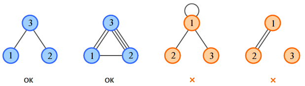

<h1 style='text-align: center;'> B. Simple Molecules</h1>

<h5 style='text-align: center;'>time limit per test: 1 second</h5>
<h5 style='text-align: center;'>memory limit per test: 256 megabytes</h5>

Mad scientist Mike is busy carrying out experiments in chemistry. Today he will attempt to join three atoms into one molecule.

A molecule consists of atoms, with some pairs of atoms connected by atomic bonds. Each atom has a valence number — the number of bonds the atom must form with other atoms. An atom can form one or multiple bonds with any other atom, but it cannot form a bond with itself. The number of bonds of an atom in the molecule must be equal to its valence number.

  Mike knows valence numbers of the three atoms. Find a molecule that can be built from these atoms according to the stated rules, or determine that it is impossible.

## Input

The single line of the input contains three space-separated integers *a*, *b* and *c* (1 ≤ *a*, *b*, *c* ≤ 106) — the valence numbers of the given atoms.

## Output

If such a molecule can be built, print three space-separated integers — the number of bonds between the 1-st and the 2-nd, the 2-nd and the 3-rd, the 3-rd and the 1-st atoms, correspondingly. If there are multiple solutions, output any of them. If there is no solution, print "Impossible" (without the quotes).

## Examples

## Input


```
1 1 2  

```
## Output


```
0 1 1  

```
## Input


```
3 4 5  

```
## Output


```
1 3 2  

```
## Input


```
4 1 1  

```
## Output


```
Impossible  

```
## Note

The first sample corresponds to the first figure. There are no bonds between atoms 1 and 2 in this case.

The second sample corresponds to the second figure. There is one or more bonds between each pair of atoms.

The third sample corresponds to the third figure. There is no solution, because an atom cannot form bonds with itself.

The configuration in the fourth figure is impossible as each atom must have at least one atomic bond.


#### tags 

#1200 #brute_force #graphs #math 