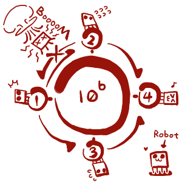

<h1 style='text-align: center;'> D. Robot Control</h1>

<h5 style='text-align: center;'>time limit per test: 6 seconds</h5>
<h5 style='text-align: center;'>memory limit per test: 256 megabytes</h5>

The boss of the Company of Robot is a cruel man. His motto is "Move forward Or Die!". And that is exactly what his company's product do. Look at the behavior of the company's robot when it is walking in the directed graph. This behavior has been called "Three Laws of Robotics":

* Law 1. The Robot will destroy itself when it visits a vertex of the graph which it has already visited.
* Law 2. The Robot will destroy itself when it has no way to go (that is when it reaches a vertex whose out-degree is zero).
* Law 3. The Robot will move randomly when it has multiple ways to move (that is when it reach a vertex whose out-degree is more than one). Of course, the robot can move only along the directed edges of the graph.

Can you imagine a robot behaving like that? That's why they are sold at a very low price, just for those who are short of money, including mzry1992, of course. mzry1992 has such a robot, and she wants to move it from vertex *s* to vertex *t* in a directed graph safely without self-destruction. Luckily, she can send her robot special orders at each vertex. A special order shows the robot which way to move, if it has multiple ways to move (to prevent random moving of the robot according to Law 3). When the robot reaches vertex *t*, mzry1992 takes it off the graph immediately. So you can see that, as long as there exists a path from *s* to *t*, she can always find a way to reach the goal (whatever the vertex *t* has the outdegree of zero or not). 

  Sample 2 However, sending orders is expensive, so your task is to find the minimum number of orders mzry1992 needs to send in the worst case. Please note that mzry1992 can give orders to the robot while it is walking on the graph. Look at the first sample to clarify that part of the problem.

## Input

The first line contains two integers *n* (1 ≤ *n* ≤ 106) — the number of vertices of the graph, and *m* (1 ≤ *m* ≤ 106) — the number of edges. Then *m* lines follow, each with two integers *u**i* and *v**i* (1 ≤ *u**i*, *v**i* ≤ *n*; *v**i* ≠ *u**i*), these integers denote that there is a directed edge from vertex *u**i* to vertex *v**i*. The last line contains two integers *s* and *t* (1 ≤ *s*, *t* ≤ *n*).

It is guaranteed that there are no multiple edges and self-loops.

## Output

If there is a way to reach a goal, print the required minimum number of orders in the worst case. Otherwise, print -1.

## Examples

## Input


```
4 6  
1 2  
2 1  
1 3  
3 1  
2 4  
3 4  
1 4  

```
## Output


```
1  

```
## Input


```
4 5  
1 2  
2 1  
1 3  
2 4  
3 4  
1 4  

```
## Output


```
1  

```
## Note

Consider the first test sample. Initially the robot is on vertex 1. So, on the first step the robot can go to vertex 2 or 3. No matter what vertex the robot chooses, mzry1992 must give an order to the robot. This order is to go to vertex 4. If mzry1992 doesn't give an order to the robot at vertex 2 or 3, the robot can choose the "bad" outgoing edge (return to vertex 1) according Law 3. So, the answer is one.


#### tags 

#2600 #dp #graphs #shortest_paths 