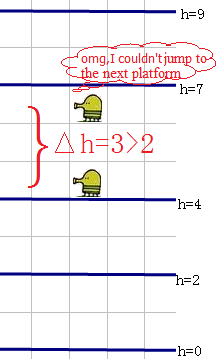

<h1 style='text-align: center;'> E. Doodle Jump</h1>

<h5 style='text-align: center;'>time limit per test: 2 seconds</h5>
<h5 style='text-align: center;'>memory limit per test: 256 megabytes</h5>

 In Doodle Jump the aim is to guide a four-legged creature called "The Doodler" up a never-ending series of platforms without falling. — Wikipedia. 

It is a very popular game and xiaodao likes it very much. One day when playing the game she wondered whether there exists a platform that the doodler couldn't reach due to the limits of its jumping ability. Consider the following problem.

There are *n* platforms. The height of the *x*-th (1 ≤ *x* ≤ *n*) platform is *a*·*x* mod *p*, where *a* and *p* are positive co-prime integers. The maximum possible height of a Doodler's jump is *h*. That is, it can jump from height *h*1 to height *h*2 (*h*1 < *h*2) if *h*2 - *h*1 ≤ *h*. Initially, the Doodler is on the ground, the height of which is 0. The question is whether it can reach the highest platform or not.

For example, when *a* = 7, *n* = 4, *p* = 12, *h* = 2, the heights of the platforms are 7, 2, 9, 4 as in the picture below. With the first jump the Doodler can jump to the platform at height 2, with the second one the Doodler can jump to the platform at height 4, but then it can't jump to any of the higher platforms. So, it can't reach the highest platform.

  User xiaodao thought about the problem for a long time but didn't solve it, so she asks you for help. Also, she has a lot of instances of the problem. Your task is solve all of these instances.

## Input

The first line contains an integer *t* (1 ≤ *t* ≤ 104) — the number of problem instances. Each of the next *t* lines contains four integers *a*, *n*, *p* and *h* (1 ≤ *a* ≤ 109, 1 ≤ *n* < *p* ≤ 109, 0 ≤ *h* ≤ 109). It's guaranteed that *a* and *p* are co-prime.

## Output

For each problem instance, if the Doodler can reach the highest platform, output "YES", otherwise output "NO".

## Examples

## Input


```
3  
7 4 12 2  
7 1 9 4  
7 4 12 3  

```
## Output


```
NO  
NO  
YES  

```


#### tags 

#3000 #math #number_theory 