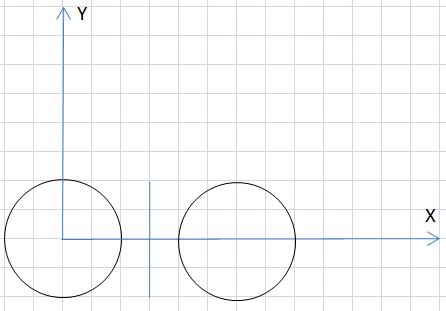

<h1 style='text-align: center;'> D. Looking for Owls</h1>

<h5 style='text-align: center;'>time limit per test: 2 seconds</h5>
<h5 style='text-align: center;'>memory limit per test: 256 megabytes</h5>

Emperor Palpatine loves owls very much. The emperor has some blueprints with the new Death Star, the blueprints contain *n* distinct segments and *m* distinct circles. We will consider the segments indexed from 1 to *n* in some way and the circles — indexed from 1 to *m* in some way. 

Palpatine defines an owl as a set of a pair of distinct circles (*i*, *j*) (*i* < *j*) and one segment *k*, such that: 

1. circles *i* and *j* are symmetrical relatively to the straight line containing segment *k*;
2. circles *i* and *j* don't have any common points;
3. circles *i* and *j* have the same radius;
4. segment *k* intersects the segment that connects the centers of circles *i* and *j*.

Help Palpatine, count the number of distinct owls on the picture. 

## Input

The first line contains two integers — *n* and *m* (1 ≤ *n* ≤ 3·105, 2 ≤ *m* ≤ 1500). 

The next *n* lines contain four integers each, *x*1, *y*1, *x*2, *y*2 — the coordinates of the two endpoints of the segment. It's guaranteed that each segment has positive length.

The next *m* lines contain three integers each, *x**i*, *y**i*, *r**i* — the coordinates of the center and the radius of the *i*-th circle. All coordinates are integers of at most 104 in their absolute value. The radius is a positive integer of at most 104.

It is guaranteed that all segments and all circles are dictinct.

## Output

Print a single number — the answer to the problem.

Please, do not use the %lld specifier to output 64-bit integers is С++. It is preferred to use the cout stream or the %I64d specifier.

## Examples

## Input


```
1 2  
3 2 3 -2  
0 0 2  
6 0 2  

```
## Output


```
1  

```
## Input


```
3 2  
0 0 0 1  
0 -1 0 1  
0 -1 0 0  
2 0 1  
-2 0 1  

```
## Output


```
3  

```
## Input


```
1 2  
-1 0 1 0  
-100 0 1  
100 0 1  

```
## Output


```
0  

```
## Note

Here's an owl from the first sample. The owl is sitting and waiting for you to count it. 

  

#### tags 

#2400 #binary_search #data_structures #geometry #hashing #sortings 