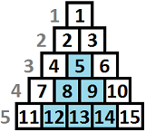
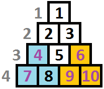

<h1 style='text-align: center;'> D. Transferring Pyramid</h1>

<h5 style='text-align: center;'>time limit per test: 3 seconds</h5>
<h5 style='text-align: center;'>memory limit per test: 256 megabytes</h5>

Vasya and Petya are using an interesting data storing structure: a pyramid.

The pyramid consists of *n* rows, the *i*-th row contains *i* cells. Each row is shifted half a cell to the left relative to the previous row. The cells are numbered by integers from 1 to  as shown on the picture below.

An example of a pyramid at *n* = 5 is: 

  This data structure can perform operations of two types: 

1. Change the value of a specific cell. It is described by three integers: "*t* *i* *v*", where *t* = 1 (the type of operation), *i* — the number of the cell to change and *v* the value to assign to the cell.
2. Change the value of some subpyramid. The picture shows a highlighted subpyramid with the top in cell 5. It is described by *s* + 2 numbers: "*t* *i* *v*1 *v*2 ... *v**s*", where *t* = 2, *i* — the number of the top cell of the pyramid, *s* — the size of the subpyramid (the number of cells it has), *v**j* — the value you should assign to the *j*-th cell of the subpyramid.

Formally: a subpyramid with top at the *i*-th cell of the *k*-th row (the 5-th cell is the second cell of the third row) will contain cells from rows from *k* to *n*, the (*k* + *p*)-th row contains cells from the *i*-th to the (*i* + *p*)-th (0 ≤ *p* ≤ *n* - *k*).

Vasya and Petya had two identical pyramids. Vasya changed some cells in his pyramid and he now wants to send his changes to Petya. For that, he wants to find a sequence of operations at which Petya can repeat all Vasya's changes. Among all possible sequences, Vasya has to pick the minimum one (the one that contains the fewest numbers).

You have a pyramid of *n* rows with *k* changed cells. Find the sequence of operations which result in each of the *k* changed cells being changed by at least one operation. Among all the possible sequences pick the one that contains the fewest numbers.

## Input

The first line contains two integers *n* and *k* (1 ≤ *n*, *k* ≤ 105).

The next *k* lines contain the coordinates of the modified cells *r**i* and *c**i* (1 ≤ *c**i* ≤ *r**i* ≤ *n*) — the row and the cell's number in the row. All cells are distinct.

## Output

Print a single number showing how many numbers the final sequence has.

## Examples

## Input


```
4 5  
3 1  
3 3  
4 1  
4 3  
4 4  

```
## Output


```
10  

```
## Input


```
7 11  
2 2  
3 1  
4 3  
5 1  
5 2  
5 5  
6 4  
7 2  
7 3  
7 4  
7 5  

```
## Output


```
26  

```
## Note

One of the possible solutions of the first sample consists of two operations:

2 4 *v*4 *v*7 *v*8

2 6 *v*6 *v*9 *v*10

The picture shows the changed cells color-highlighted. The subpyramid used by the first operation is highlighted blue and the subpyramid used by the first operation is highlighted yellow: 

  

#### tags 

#2900 #dp 