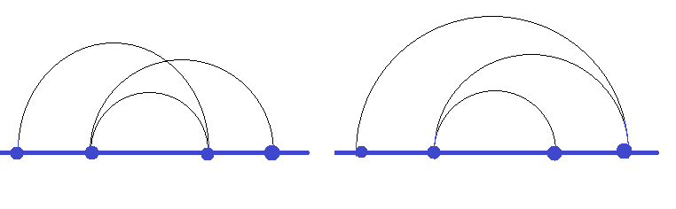

<h1 style='text-align: center;'> A. Dima and Continuous Line</h1>

<h5 style='text-align: center;'>time limit per test: 2 seconds</h5>
<h5 style='text-align: center;'>memory limit per test: 256 megabytes</h5>

Dima and Seryozha live in an ordinary dormitory room for two. One day Dima had a date with his girl and he asked Seryozha to leave the room. As a compensation, Seryozha made Dima do his homework.

The teacher gave Seryozha the coordinates of *n* distinct points on the abscissa axis and asked to consecutively connect them by semi-circus in a certain order: first connect the first point with the second one, then connect the second point with the third one, then the third one with the fourth one and so on to the *n*-th point. Two points with coordinates (*x*1, 0) and (*x*2, 0) should be connected by a semi-circle that passes above the abscissa axis with the diameter that coincides with the segment between points. Seryozha needs to find out if the line on the picture intersects itself. For clarifications, see the picture Seryozha showed to Dima (the left picture has self-intersections, the right picture doesn't have any).

  Seryozha is not a small boy, so the coordinates of the points can be rather large. Help Dima cope with the problem.

## Input

The first line contains a single integer *n* (1 ≤ *n* ≤ 103). The second line contains *n* distinct integers *x*1, *x*2, ..., *x**n* ( - 106 ≤ *x**i* ≤ 106) — the *i*-th point has coordinates (*x**i*, 0). The points are not necessarily sorted by their *x* coordinate.

## Output

In the single line print "yes" (without the quotes), if the line has self-intersections. Otherwise, print "no" (without the quotes).

## Examples

## Input


```
4  
0 10 5 15  

```
## Output


```
yes  

```
## Input


```
4  
0 15 5 10  

```
## Output


```
no  

```
## Note

The first test from the statement is on the picture to the left, the second test is on the picture to the right.


#### tags 

#1400 #brute_force #implementation 