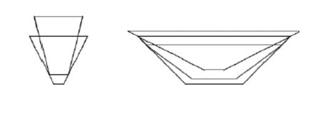

<h1 style='text-align: center;'> C. Bowls</h1>

<h5 style='text-align: center;'>time limit per test: 2 seconds</h5>
<h5 style='text-align: center;'>memory limit per test: 64 megabytes</h5>

Once Petya was in such a good mood that he decided to help his mum with the washing-up. There were *n* dirty bowls in the sink. From the geometrical point of view each bowl looks like a blunted cone. We can disregard the width of the walls and bottom. Petya puts the clean bowls one on another naturally, i. e. so that their vertical axes coincide (see the picture). You will be given the order in which Petya washes the bowls. Determine the height of the construction, i.e. the distance from the bottom of the lowest bowl to the top of the highest one. 

  ## Input

The first input line contains integer *n* (1 ≤ *n* ≤ 3000). Each of the following *n* lines contains 3 integers *h*, *r* and *R* (1 ≤ *h* ≤ 10000, 1 ≤ *r* < *R* ≤ 10000). They are the height of a bowl, the radius of its bottom and the radius of its top. The plates are given in the order Petya puts them on the table.

## Output

## Output

 the height of the plate pile accurate to at least 10- 6.

## Examples

## Input


```
2  
40 10 50  
60 20 30  

```
## Output


```
70.00000000  

```
## Input


```
3  
50 30 80  
35 25 70  
40 10 90  

```
## Output


```
55.00000000  

```


#### tags 

#2200 #geometry #implementation 