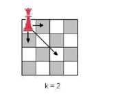

<h1 style='text-align: center;'> D. New Game with a Chess Piece</h1>

<h5 style='text-align: center;'>time limit per test: 2 seconds</h5>
<h5 style='text-align: center;'>memory limit per test: 64 megabytes</h5>

Petya and Vasya are inventing a new game that requires a rectangular board and one chess piece. At the beginning of the game the piece stands in the upper-left corner of the board. Two players move the piece in turns. Each turn the chess piece can be moved either one square to the right or one square down or jump *k* squares diagonally down and to the right. The player who can’t move the piece loses. 

  The guys haven’t yet thought what to call the game or the best size of the board for it. Your task is to write a program that can determine the outcome of the game depending on the board size.

## Input

The first input line contains two integers *t* and *k* (1 ≤ *t* ≤ 20, 1 ≤ *k* ≤ 109). Each of the following *t* lines contains two numbers *n*, *m* — the board’s length and width (1 ≤ *n*, *m* ≤ 109).

## Output

## Output

 *t* lines that can determine the outcomes of the game on every board. Write «+» if the first player is a winner, and «-» otherwise.

## Examples

## Input


```
10 2  
1 1  
1 2  
2 1  
2 2  
1 3  
2 3  
3 1  
3 2  
3 3  
4 3  

```
## Output


```
-  
+  
+  
-  
-  
+  
-  
+  
+  
+  

```


#### tags 

#2300 #games 