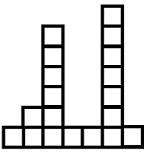

<h1 style='text-align: center;'> B. Fence</h1>

<h5 style='text-align: center;'>time limit per test: 1 second</h5>
<h5 style='text-align: center;'>memory limit per test: 256 megabytes</h5>

There is a fence in front of Polycarpus's home. The fence consists of *n* planks of the same width which go one after another from left to right. The height of the *i*-th plank is *h**i* meters, distinct planks can have distinct heights.

  Fence for *n* = 7 and *h* = [1, 2, 6, 1, 1, 7, 1] Polycarpus has bought a posh piano and is thinking about how to get it into the house. In order to carry out his plan, he needs to take exactly *k* consecutive planks from the fence. Higher planks are harder to tear off the fence, so Polycarpus wants to find such *k* consecutive planks that the sum of their heights is minimal possible.

Write the program that finds the indexes of *k* consecutive planks with minimal total height. Pay attention, the fence is not around Polycarpus's home, it is in front of home (in other words, the fence isn't cyclic).

## Input

The first line of the input contains integers *n* and *k* (1 ≤ *n* ≤ 1.5·105, 1 ≤ *k* ≤ *n*) — the number of planks in the fence and the width of the hole for the piano. The second line contains the sequence of integers *h*1, *h*2, ..., *h**n* (1 ≤ *h**i* ≤ 100), where *h**i* is the height of the *i*-th plank of the fence.

## Output

Print such integer *j* that the sum of the heights of planks *j*, *j* + 1, ..., *j* + *k* - 1 is the minimum possible. If there are multiple such *j*'s, print any of them.

## Examples

## Input


```
7 3  
1 2 6 1 1 7 1  

```
## Output


```
3  

```
## Note

In the sample, your task is to find three consecutive planks with the minimum sum of heights. In the given case three planks with indexes 3, 4 and 5 have the required attribute, their total height is 8.


#### tags 

#1100 #brute_force #dp 