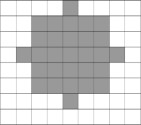

<h1 style='text-align: center;'> E. Two Circles</h1>

<h5 style='text-align: center;'>time limit per test: 4 seconds</h5>
<h5 style='text-align: center;'>memory limit per test: 256 megabytes</h5>

Let's assume that we are given an *n* × *m* table filled by integers. We'll mark a cell in the *i*-th row and *j*-th column as (*i*, *j*). Thus, (1, 1) is the upper left cell of the table and (*n*, *m*) is the lower right cell. We'll assume that a circle of radius *r* with the center in cell (*i*0, *j*0) is a set of such cells (*i*, *j*) that . We'll consider only the circles that do not go beyond the limits of the table, that is, for which *r* + 1 ≤ *i*0 ≤ *n* - *r* and *r* + 1 ≤ *j*0 ≤ *m* - *r*. 

  A circle of radius 3 with the center at (4, 5). Find two such non-intersecting circles of the given radius *r* that the sum of numbers in the cells that belong to these circles is maximum. Two circles intersect if there is a cell that belongs to both circles. As there can be more than one way to choose a pair of circles with the maximum sum, we will also be interested in the number of such pairs. Calculate the number of unordered pairs of circles, for instance, a pair of circles of radius 2 with centers at (3, 4) and (7, 7) is the same pair as the pair of circles of radius 2 with centers at (7, 7) and (3, 4). 

## Input

The first line contains three integers *n*, *m* and *r* (2 ≤ *n*, *m* ≤ 500, *r* ≥ 0). Each of the following *n* lines contains *m* integers from 1 to 1000 each — the elements of the table. The rows of the table are listed from top to bottom at the elements in the rows are listed from left to right. It is guaranteed that there is at least one circle of radius *r*, not going beyond the table limits. 

## Output

Print two integers — the maximum sum of numbers in the cells that are located into two non-intersecting circles and the number of pairs of non-intersecting circles with the maximum sum. If there isn't a single pair of non-intersecting circles, print 0 0.

## Examples

## Input


```
2 2 0  
1 2  
2 4  

```
## Output


```
6 2  

```
## Input


```
5 6 1  
4 2 1 3 2 6  
2 3 2 4 7 2  
5 2 2 1 1 3  
1 4 3 3 6 4  
5 1 4 2 3 2  

```
## Output


```
34 3  

```
## Input


```
3 3 1  
1 2 3  
4 5 6  
7 8 9  

```
## Output


```
0 0  

```


#### tags 

#2500 #brute_force #data_structures #implementation 