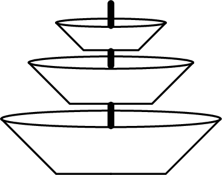

<h1 style='text-align: center;'> D. Vessels</h1>

<h5 style='text-align: center;'>time limit per test: 2 seconds</h5>
<h5 style='text-align: center;'>memory limit per test: 256 megabytes</h5>

There is a system of *n* vessels arranged one above the other as shown in the figure below. Assume that the vessels are numbered from 1 to *n*, in the order from the highest to the lowest, the volume of the *i*-th vessel is *a**i* liters.

  Initially, all the vessels are empty. In some vessels water is poured. All the water that overflows from the *i*-th vessel goes to the (*i* + 1)-th one. The liquid that overflows from the *n*-th vessel spills on the floor.

Your task is to simulate pouring water into the vessels. To do this, you will need to handle two types of queries:

1. Add *x**i* liters of water to the *p**i*-th vessel;
2. Print the number of liters of water in the *k**i*-th vessel.

When you reply to the second request you can assume that all the water poured up to this point, has already overflown between the vessels.

## Input

The first line contains integer *n* — the number of vessels (1 ≤ *n* ≤ 2·105). The second line contains *n* integers *a*1, *a*2, ..., *a**n* — the vessels' capacities (1 ≤ *a**i* ≤ 109). The vessels' capacities do not necessarily increase from the top vessels to the bottom ones (see the second sample). The third line contains integer *m* — the number of queries (1 ≤ *m* ≤ 2·105). Each of the next *m* lines contains the description of one query. The query of the first type is represented as "1 *p**i* *x**i*", the query of the second type is represented as "2 *k**i*" (1 ≤ *p**i* ≤ *n*, 1 ≤ *x**i* ≤ 109, 1 ≤ *k**i* ≤ *n*).

## Output

For each query, print on a single line the number of liters of water in the corresponding vessel.

## Examples

## Input


```
2  
5 10  
6  
1 1 4  
2 1  
1 2 5  
1 1 4  
2 1  
2 2  

```
## Output


```
4  
5  
8  

```
## Input


```
3  
5 10 8  
6  
1 1 12  
2 2  
1 1 6  
1 3 2  
2 2  
2 3  

```
## Output


```
7  
10  
5  

```


#### tags 

#1800 #data_structures #dsu #implementation #trees 