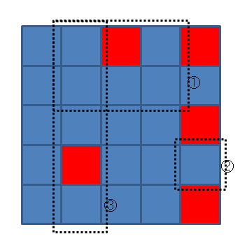

<h1 style='text-align: center;'> B. Counting Rectangles is Fun</h1>

<h5 style='text-align: center;'>time limit per test: 4 seconds</h5>
<h5 style='text-align: center;'>memory limit per test: 256 megabytes</h5>

There is an *n* × *m* rectangular grid, each cell of the grid contains a single integer: zero or one. Let's call the cell on the *i*-th row and the *j*-th column as (*i*, *j*).

Let's define a "rectangle" as four integers *a*, *b*, *c*, *d* (1 ≤ *a* ≤ *c* ≤ *n*; 1 ≤ *b* ≤ *d* ≤ *m*). Rectangle denotes a set of cells of the grid {(*x*, *y*) :  *a* ≤ *x* ≤ *c*, *b* ≤ *y* ≤ *d*}. Let's define a "good rectangle" as a rectangle that includes only the cells with zeros.

You should answer the following *q* queries: calculate the number of good rectangles all of which cells are in the given rectangle.

## Input

There are three integers in the first line: *n*, *m* and *q* (1 ≤ *n*, *m* ≤ 40, 1 ≤ *q* ≤ 3·105). Each of the next *n* lines contains *m* characters — the grid. Consider grid rows are numbered from top to bottom, and grid columns are numbered from left to right. Both columns and rows are numbered starting from 1. 

Each of the next *q* lines contains a query — four integers that describe the current rectangle, *a*, *b*, *c*, *d* (1 ≤ *a* ≤ *c* ≤ *n*; 1 ≤ *b* ≤ *d* ≤ *m*).

## Output

For each query output an answer — a single integer in a separate line.

## Examples

## Input


```
5 5 5  
00101  
00000  
00001  
01000  
00001  
1 2 2 4  
4 5 4 5  
1 2 5 2  
2 2 4 5  
4 2 5 3  

```
## Output


```
10  
1  
7  
34  
5  

```
## Input


```
4 7 5  
0000100  
0000010  
0011000  
0000000  
1 7 2 7  
3 1 3 1  
2 3 4 5  
1 2 2 7  
2 2 4 7  

```
## Output


```
3  
1  
16  
27  
52  

```
## Note

For the first example, there is a 5 × 5 rectangular grid, and the first, the second, and the third queries are represented in the following image.

  * For the first query, there are 10 good rectangles, five 1 × 1, two 2 × 1, two 1 × 2, and one 1 × 3.
* For the second query, there is only one 1 × 1 good rectangle.
* For the third query, there are 7 good rectangles, four 1 × 1, two 2 × 1, and one 3 × 1.


#### tags 

#1900 #brute_force #divide_and_conquer #dp 