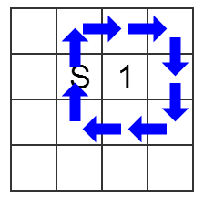
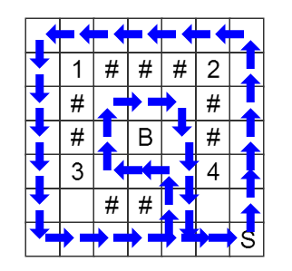

<h1 style='text-align: center;'> C. Circling Round Treasures</h1>

<h5 style='text-align: center;'>time limit per test: 1 second</h5>
<h5 style='text-align: center;'>memory limit per test: 256 megabytes</h5>

You have a map as a rectangle table. Each cell of the table is either an obstacle, or a treasure with a certain price, or a bomb, or an empty cell. Your initial position is also given to you.

You can go from one cell of the map to a side-adjacent one. At that, you are not allowed to go beyond the borders of the map, enter the cells with treasures, obstacles and bombs. To pick the treasures, you need to build a closed path (starting and ending in the starting cell). The closed path mustn't contain any cells with bombs inside. Let's assume that the sum of the treasures' values that are located inside the closed path equals *v*, and besides, you've made *k* single moves (from one cell to another) while you were going through the path, then such path brings you the profit of *v* - *k* rubles.

Your task is to build a closed path that doesn't contain any bombs and brings maximum profit.

## Note

 that the path can have self-intersections. In order to determine if a cell lies inside a path or not, use the following algorithm:

1. Assume that the table cells are points on the plane (the table cell on the intersection of the *i*-th column and the *j*-th row is point (*i*, *j*)). And the given path is a closed polyline that goes through these points.
2. You need to find out if the point *p* of the table that is not crossed by the polyline lies inside the polyline.
3. Let's draw a ray that starts from point *p* and does not intersect other points of the table (such ray must exist).
4. Let's count the number of segments of the polyline that intersect the painted ray. If this number is odd, we assume that point *p* (and consequently, the table cell) lie inside the polyline (path). Otherwise, we assume that it lies outside.
## Input

The first line contains two integers *n* and *m* (1 ≤ *n*, *m* ≤ 20) — the sizes of the table. Next *n* lines each contains *m* characters — the description of the table. The description means the following:

* character "B" is a cell with a bomb;
* character "S" is the starting cell, you can assume that it's empty;
* digit *c* (1-8) is treasure with index *c*;
* character "." is an empty cell;
* character "#" is an obstacle.

Assume that the map has *t* treasures. Next *t* lines contain the prices of the treasures. The *i*-th line contains the price of the treasure with index *i*, *v**i* ( - 200 ≤ *v**i* ≤ 200). It is guaranteed that the treasures are numbered from 1 to *t*. It is guaranteed that the map has not more than 8 objects in total. Objects are bombs and treasures. It is guaranteed that the map has exactly one character "S".

## Output

Print a single integer — the maximum possible profit you can get.

## Examples

## Input


```
4 4  
....  
.S1.  
....  
....  
10  

```
## Output


```
2  

```
## Input


```
7 7  
.......  
.1###2.  
.#...#.  
.#.B.#.  
.3...4.  
..##...  
......S  
100  
100  
100  
100  

```
## Output


```
364  

```
## Input


```
7 8  
........  
........  
....1B..  
.S......  
....2...  
3.......  
........  
100  
-100  
100  

```
## Output


```
0  

```
## Input


```
1 1  
S  

```
## Output


```
0  

```
## Note

In the first example the answer will look as follows.

  In the second example the answer will look as follows.

  In the third example you cannot get profit.

In the fourth example you cannot get profit as you cannot construct a closed path with more than one cell.


#### tags 

#2600 #bitmasks #shortest_paths 