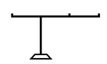
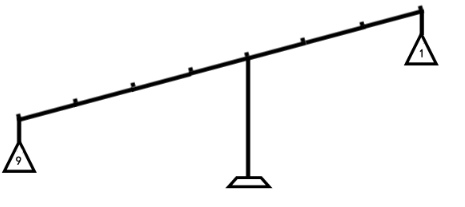
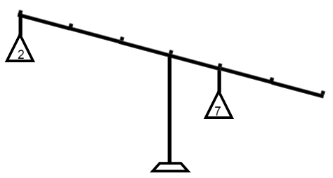
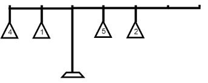

<h1 style='text-align: center;'> A. Lever</h1>

<h5 style='text-align: center;'>time limit per test: 1 second</h5>
<h5 style='text-align: center;'>memory limit per test: 256 megabytes</h5>

You have a description of a lever as string *s*. We'll represent the string length as record |*s*|, then the lever looks as a horizontal bar with weights of length |*s*| - 1 with exactly one pivot. We will assume that the bar is a segment on the *Ox* axis between points 0 and |*s*| - 1.

The decoding of the lever description is given below.

* If the *i*-th character of the string equals "^", that means that at coordinate *i* there is the pivot under the bar.
* If the *i*-th character of the string equals "=", that means that at coordinate *i* there is nothing lying on the bar.
* If the *i*-th character of the string equals digit *c* (1-9), that means that at coordinate *i* there is a weight of mass *c* on the bar.

Your task is, given the lever description, print if it will be in balance or not. Assume that the bar doesn't weight anything. Assume that the bar initially is in balance then all weights are simultaneously put on it. After that the bar either tilts to the left, or tilts to the right, or is in balance.

## Input

The first line contains the lever description as a non-empty string *s* (3 ≤ |*s*| ≤ 106), consisting of digits (1-9) and characters "^" and "=". It is guaranteed that the line contains exactly one character "^". It is guaranteed that the pivot of the lever isn't located in any end of the lever bar.

To solve the problem you may need 64-bit integer numbers. Please, do not forget to use them in your programs.

## Output

Print "left" if the given lever tilts to the left, "right" if it tilts to the right and "balance", if it is in balance.

## Examples

## Input


```
=^==  

```
## Output


```
balance  

```
## Input


```
9===^==1  

```
## Output


```
left  

```
## Input


```
2==^7==  

```
## Output


```
right  

```
## Input


```
41^52==  

```
## Output


```
balance  

```
## Note

As you solve the problem, you may find the following link useful to better understand how a lever functions: http://en.wikipedia.org/wiki/Lever.

The pictures to the examples:

        

#### tags 

#900 #implementation #math 