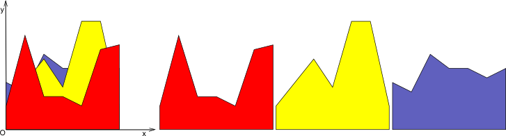

<h1 style='text-align: center;'> E. New Year Tree Decorations</h1>

<h5 style='text-align: center;'>time limit per test: 1 second</h5>
<h5 style='text-align: center;'>memory limit per test: 256 megabytes</h5>

Due to atheistic Soviet past, Christmas wasn't officially celebrated in Russia for most of the twentieth century. As a result, the Russian traditions for Christmas and New Year mixed into one event celebrated on the New Year but including the tree, a Santa-like 'Grandfather Frost', presents and huge family reunions and dinner parties all over the country. Bying a Tree at the New Year and installing it in the house is a tradition. Usually the whole family decorates the tree on the New Year Eve. We hope that Codeforces is a big and loving family, so in this problem we are going to decorate a tree as well.

So, our decoration consists of *n* pieces, each piece is a piece of colored paper, its border is a closed polyline of a special shape. The pieces go one by one as is shown on the picture. The *i*-th piece is a polyline that goes through points: (0, 0), (0, *y*0), (1, *y*1), (2, *y*2), ..., (*k*, *y**k*), (*k*, 0). The width of each piece equals *k*.

  The figure to the left shows the decoration, the figure to the right shows the individual pieces it consists of. The piece number 1 (shown red on the figure) is the outer piece (we see it completely), piece number 2 (shown yellow) follows it (we don't see it completely as it is partially closed by the first piece) and so on. The programmers are quite curious guys, so the moment we hung a decoration on the New Year tree we started to wonder: what area of each piece can people see?

## Input

The first line contains two integers, *n* and *k* (1 ≤ *n*, *k* ≤ 300). Each of the following *n* lines contains *k* + 1 integers — the description of the polyline. If the *i*-th line contains ontegers *y**i*, 0, *y**i*, 1, ..., *y**i*, *k*, that means that the polyline of the *i*-th piece goes through points (0, 0), (0, *y**i*, 0), (1, *y**i*, 1), (2, *y**i*, 2), ..., (*k*, *y**i*, *k*), (*k*, 0) (1 ≤ *y**i*, *j* ≤ 1000).

## Output

Print *n* real numbers — for each polyline, the area of its visible part.

The answer will be considered correct if its relative or absolute error do not exceed 10- 4. 

## Examples

## Input


```
2 2  
2 1 2  
1 2 1  

```
## Output


```
3.000000000000  
0.500000000000  

```
## Input


```
1 1  
1 1  

```
## Output


```
1.000000000000  

```
## Input


```
4 1  
2 7  
7 2  
5 5  
6 4  

```
## Output


```
4.500000000000  
1.250000000000  
0.050000000000  
0.016666666667  

```


#### tags 

#2500 #geometry #schedules #sortings 