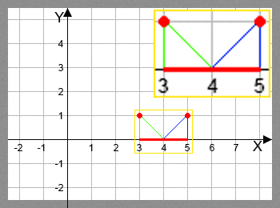
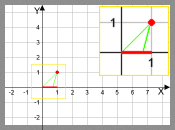
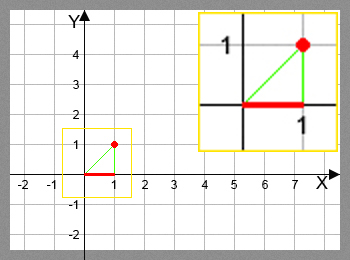

<h1 style='text-align: center;'> D. Bear and Floodlight</h1>

<h5 style='text-align: center;'>time limit per test: 4 seconds</h5>
<h5 style='text-align: center;'>memory limit per test: 256 megabytes</h5>

One day a bear lived on the *Oxy* axis. He was afraid of the dark, so he couldn't move at night along the plane points that aren't lit. One day the bear wanted to have a night walk from his house at point (*l*, 0) to his friend's house at point (*r*, 0), along the segment of length (*r* - *l*). Of course, if he wants to make this walk, he needs each point of the segment to be lit. That's why the bear called his friend (and yes, in the middle of the night) asking for a very delicate favor.

The *Oxy* axis contains *n* floodlights. Floodlight *i* is at point (*x**i*, *y**i*) and can light any angle of the plane as large as *a**i* degree with vertex at point (*x**i*, *y**i*). The bear asked his friend to turn the floodlights so that he (the bear) could go as far away from his house as possible during the walking along the segment. His kind friend agreed to fulfill his request. And while he is at it, the bear wonders: what is the furthest he can go away from his house? Hep him and find this distance.

Consider that the plane has no obstacles and no other light sources besides the floodlights. The bear's friend cannot turn the floodlights during the bear's walk. Assume that after all the floodlights are turned in the correct direction, the bear goes for a walk and his friend goes to bed.

## Input

The first line contains three space-separated integers *n*, *l*, *r* (1 ≤ *n* ≤ 20;  - 105 ≤ *l* ≤ *r* ≤ 105). The *i*-th of the next *n* lines contain three space-separated integers *x**i*, *y**i*, *a**i* ( - 1000 ≤ *x**i* ≤ 1000; 1 ≤ *y**i* ≤ 1000; 1 ≤ *a**i* ≤ 90) — the floodlights' description. 

## Note

 that two floodlights can be at the same point of the plane.

## Output

Print a single real number — the answer to the problem. The answer will be considered correct if its relative or absolute error doesn't exceed 10- 6.

## Examples

## Input


```
2 3 5  
3 1 45  
5 1 45  

```
## Output


```
2.000000000  

```
## Input


```
1 0 1  
1 1 30  

```
## Output


```
0.732050808  

```
## Input


```
1 0 1  
1 1 45  

```
## Output


```
1.000000000  

```
## Input


```
1 0 2  
0 2 90  

```
## Output


```
2.000000000  

```
## Note

In the first sample, one of the possible solutions is: 

  In the second sample, a single solution is: 

  In the third sample, a single solution is: 

  

#### tags 

#2200 #bitmasks #dp #geometry 