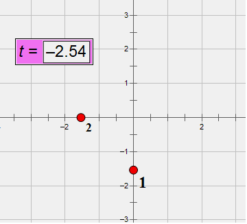
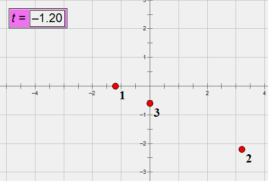
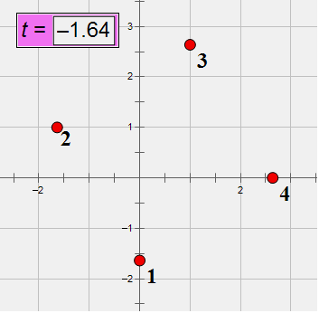
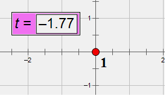

<h1 style='text-align: center;'> E. Fox and Meteor Shower</h1>

<h5 style='text-align: center;'>time limit per test: 6 seconds</h5>
<h5 style='text-align: center;'>memory limit per test: 256 megabytes</h5>

There is a meteor shower on the sky and there are *n* meteors. The sky can be viewed as a 2D Euclid Plane and the meteor is point on this plane. 

Fox Ciel looks at the sky. She finds out that the orbit of each meteor is a straight line, and each meteor has a constant velocity. Now Ciel wants to know: what is the maximum number of meteors such that any pair met at the same position at a certain time? ## Note

 that the time is not limited and can be also negative. The meteors will never collide when they appear at the same position at the same time.

## Input

The first line contains an integer *n* (1 ≤ *n* ≤ 1000). Each of the next *n* lines contains six integers: *t*1, *x*1, *y*1, *t*2, *x*2, *y*2 — the description of a meteor's orbit: at time *t*1, the current meteor is located at the point (*x*1, *y*1) and at time *t*2, the meteor is located at point (*x*2, *y*2) ( - 106 ≤ *t*1, *x*1, *y*1, *t*2, *x*2, *y*2 ≤ 106; *t*1 ≠ *t*2). 

There will be no two meteors are always in the same position for any time.

## Output

Print a single integer — the maximum number of meteors such that any pair met at the same position at a certain time.

## Examples

## Input


```
2  
0 0 1 1 0 2  
0 1 0 1 2 0  

```
## Output


```
2  

```
## Input


```
3  
-1 -1 0 3 3 0  
0 2 -1 -1 3 -2  
-2 0 -1 6 0 3  

```
## Output


```
3  

```
## Input


```
4  
0 0 0 1 0 1  
0 0 1 1 1 1  
0 1 1 1 1 0  
0 1 0 1 0 0  

```
## Output


```
1  

```
## Input


```
1  
0 0 0 1 0 0  

```
## Output


```
1  

```
## Note

In example 1, meteor 1 and 2 meet in *t*=-1 at (0, 0).

In example 2, meteor 1 and 2 meet in *t*=1 at (1, 0), meteor 1 and 3 meet in *t*=0 at (0, 0) and meteor 2 and 3 meet in *t*=2 at (0, 1).

In example 3, no two meteor meet.

In example 4, there is only 1 meteor, and its velocity is zero.

If your browser doesn't support animation png, please see the gif version here: 

http://assets.codeforces.com/images/388e/example1.gif

http://assets.codeforces.com/images/388e/example2.gif

http://assets.codeforces.com/images/388e/example3.gif

http://assets.codeforces.com/images/388e/example4.gif


#### tags 

#3100 #geometry 