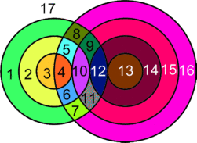

<h1 style='text-align: center;'> C. Berland Square</h1>

<h5 style='text-align: center;'>time limit per test: 2 seconds</h5>
<h5 style='text-align: center;'>memory limit per test: 256 megabytes</h5>

Last year the world's largest square was built in Berland. It is known that the square can be represented as an infinite plane with an introduced Cartesian system of coordinates. On that square two sets of concentric circles were painted. Let's call the set of concentric circles with radii 1, 2, ..., *K* and the center in the point (*z*, 0) a (*K*, *z*)-set. Thus, on the square were painted a (*N*, *x*)-set and a (*M*, *y*)-set. You have to find out how many parts those sets divided the square into.

## Input

The first line contains integers *N*, *x*, *M*, *y*. (1 ≤ *N*, *M* ≤ 100000,  - 100000 ≤ *x*, *y* ≤ 100000, *x* ≠ *y*).

## Output

Print the sought number of parts.

## Examples

## Input


```
1 0 1 1  

```
## Output


```
4  

```
## Input


```
1 0 1 2  

```
## Output


```
3  

```
## Input


```
3 3 4 7  

```
## Output


```
17  

```
## Note

Picture for the third sample:

  

#### tags 

#2300 #implementation #math 