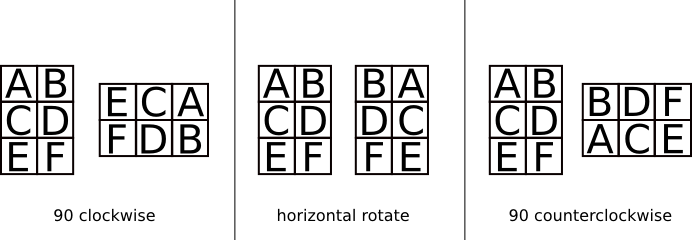

<h1 style='text-align: center;'> C. Inna and Huge Candy Matrix</h1>

<h5 style='text-align: center;'>time limit per test: 2 seconds</h5>
<h5 style='text-align: center;'>memory limit per test: 256 megabytes</h5>

Inna and Dima decided to surprise Sereja. They brought a really huge candy matrix, it's big even for Sereja! Let's number the rows of the giant matrix from 1 to *n* from top to bottom and the columns — from 1 to *m*, from left to right. We'll represent the cell on the intersection of the *i*-th row and *j*-th column as (*i*, *j*). Just as is expected, some cells of the giant candy matrix contain candies. Overall the matrix has *p* candies: the *k*-th candy is at cell (*x**k*, *y**k*).

The time moved closer to dinner and Inna was already going to eat *p* of her favourite sweets from the matrix, when suddenly Sereja (for the reason he didn't share with anyone) rotated the matrix *x* times clockwise by 90 degrees. Then he performed the horizontal rotate of the matrix *y* times. And then he rotated the matrix *z* times counterclockwise by 90 degrees. The figure below shows how the rotates of the matrix looks like.

  Inna got really upset, but Duma suddenly understood two things: the candies didn't get damaged and he remembered which cells contained Inna's favourite sweets before Sereja's strange actions. Help guys to find the new coordinates in the candy matrix after the transformation Sereja made!

## Input

The first line of the input contains fix integers *n*, *m*, *x*, *y*, *z*, *p* (1 ≤ *n*, *m* ≤ 109; 0 ≤ *x*, *y*, *z* ≤ 109; 1 ≤ *p* ≤ 105).

Each of the following *p* lines contains two integers *x**k*, *y**k* (1 ≤ *x**k* ≤ *n*; 1 ≤ *y**k* ≤ *m*) — the initial coordinates of the *k*-th candy. Two candies can lie on the same cell.

## Output

For each of the *p* candies, print on a single line its space-separated new coordinates.

## Examples

## Input


```
3 3 3 1 1 9  
1 1  
1 2  
1 3  
2 1  
2 2  
2 3  
3 1  
3 2  
3 3  

```
## Output


```
1 3  
1 2  
1 1  
2 3  
2 2  
2 1  
3 3  
3 2  
3 1  

```
## Note

Just for clarity. Horizontal rotating is like a mirroring of the matrix. For matrix:


```
  
QWER      REWQ   
ASDF  ->  FDSA  
ZXCV      VCXZ  

```


#### tags 

#1500 #implementation #math 