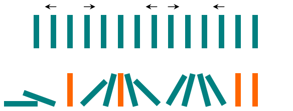

<h1 style='text-align: center;'> B. Domino Effect</h1>

<h5 style='text-align: center;'>time limit per test: 1 second</h5>
<h5 style='text-align: center;'>memory limit per test: 256 megabytes</h5>

Little Chris knows there's no fun in playing dominoes, he thinks it's too random and doesn't require skill. Instead, he decided to play with the dominoes and make a "domino show".

Chris arranges *n* dominoes in a line, placing each piece vertically upright. In the beginning, he simultaneously pushes some of the dominoes either to the left or to the right. However, somewhere between every two dominoes pushed in the same direction there is at least one domino pushed in the opposite direction.

After each second, each domino that is falling to the left pushes the adjacent domino on the left. Similarly, the dominoes falling to the right push their adjacent dominoes standing on the right. When a vertical domino has dominoes falling on it from both sides, it stays still due to the balance of the forces. The figure shows one possible example of the process.

  Given the initial directions Chris has pushed the dominoes, find the number of the dominoes left standing vertically at the end of the process!

## Input

The first line contains a single integer *n* (1 ≤ *n* ≤ 3000), the number of the dominoes in the line. The next line contains a character string *s* of length *n*. The *i*-th character of the string *s**i* is equal to 

* "L", if the *i*-th domino has been pushed to the left;
* "R", if the *i*-th domino has been pushed to the right;
* ".", if the *i*-th domino has not been pushed.

It is guaranteed that if *s**i* = *s**j* = "L" and *i* < *j*, then there exists such *k* that *i* < *k* < *j* and *s**k* = "R"; if *s**i* = *s**j* = "R" and *i* < *j*, then there exists such *k* that *i* < *k* < *j* and *s**k* = "L".

## Output

## Output

 a single integer, the number of the dominoes that remain vertical at the end of the process.

## Examples

## Input


```
14  
.L.R...LR..L..  

```
## Output


```
4  

```
## Input


```
5  
R....  

```
## Output


```
0  

```
## Input


```
1  
.  

```
## Output


```
1  

```
## Note

The first example case is shown on the figure. The four pieces that remain standing vertically are highlighted with orange.

In the second example case, all pieces fall down since the first piece topples all the other pieces.

In the last example case, a single piece has not been pushed in either direction.


#### tags 

#1100 