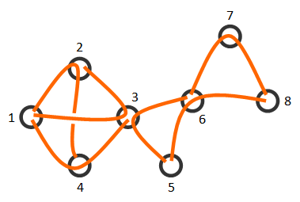

<h1 style='text-align: center;'> E. Graph Cutting</h1>

<h5 style='text-align: center;'>time limit per test: 2 seconds</h5>
<h5 style='text-align: center;'>memory limit per test: 256 megabytes</h5>

Little Chris is participating in a graph cutting contest. He's a pro. The time has come to test his skills to the fullest.

Chris is given a simple undirected connected graph with *n* vertices (numbered from 1 to *n*) and *m* edges. The problem is to cut it into edge-distinct paths of length 2. Formally, Chris has to partition all edges of the graph into pairs in such a way that the edges in a single pair are adjacent and each edge must be contained in exactly one pair.

For example, the figure shows a way Chris can cut a graph. The first sample test contains the description of this graph.

  You are given a chance to compete with Chris. Find a way to cut the given graph or determine that it is impossible!

## Input

The first line of input contains two space-separated integers *n* and *m* (1 ≤ *n*, *m* ≤ 105), the number of vertices and the number of edges in the graph. The next *m* lines contain the description of the graph's edges. The *i*-th line contains two space-separated integers *a**i* and *b**i* (1 ≤ *a**i*, *b**i* ≤ *n*; *a**i* ≠ *b**i*), the numbers of the vertices connected by the *i*-th edge. It is guaranteed that the given graph is simple (without self-loops and multi-edges) and connected.

Note: since the size of the input and output could be very large, don't use slow output techniques in your language. For example, do not use input and output streams (cin, cout) in C++.

## Output

If it is possible to cut the given graph into edge-distinct paths of length 2, output  lines. In the *i*-th line print three space-separated integers *x**i*, *y**i* and *z**i*, the description of the *i*-th path. The graph should contain this path, i.e., the graph should contain edges (*x**i*, *y**i*) and (*y**i*, *z**i*). Each edge should appear in exactly one path of length 2. If there are multiple solutions, output any of them.

If it is impossible to cut the given graph, print "No solution" (without quotes).

## Examples

## Input


```
8 12  
1 2  
2 3  
3 4  
4 1  
1 3  
2 4  
3 5  
3 6  
5 6  
6 7  
6 8  
7 8  

```
## Output


```
1 2 4  
1 3 2  
1 4 3  
5 3 6  
5 6 8  
6 7 8
```
## Input


```
3 3  
1 2  
2 3  
3 1  

```
## Output


```
No solution  

```
## Input


```
3 2  
1 2  
2 3  

```
## Output


```
1 2 3  

```


#### tags 

#2300 #dfs_and_similar #graphs 