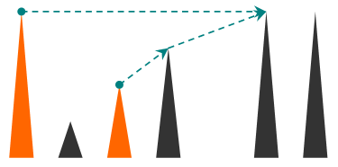

<h1 style='text-align: center;'> D. Hill Climbing</h1>

<h5 style='text-align: center;'>time limit per test: 1 second</h5>
<h5 style='text-align: center;'>memory limit per test: 256 megabytes</h5>

This problem has nothing to do with Little Chris. It is about hill climbers instead (and Chris definitely isn't one).

There are *n* hills arranged on a line, each in the form of a vertical line segment with one endpoint on the ground. The hills are numbered with numbers from 1 to *n* from left to right. The *i*-th hill stands at position *x**i* with its top at height *y**i*. For every two hills *a* and *b*, if the top of hill *a* can be seen from the top of hill *b*, their tops are connected by a rope. Formally, the tops of two hills are connected if the segment connecting their top points does not intersect or touch any of the other hill segments. Using these ropes, the hill climbers can move from hill to hill.

There are *m* teams of climbers, each composed of exactly two members. The first and the second climbers of the *i*-th team are located at the top of the *a**i*-th and *b**i*-th hills, respectively. They want to meet together at the top of some hill. Now, each of two climbers move according to the following process:

1. if a climber is at the top of the hill where the other climber is already located or will come eventually, the former climber stays at this hill;
2. otherwise, the climber picks a hill to the right of his current hill that is reachable by a rope and is the rightmost possible, climbs this hill and continues the process (the climber can also climb a hill whose top is lower than the top of his current hill).

  For each team of climbers, determine the number of the meeting hill for this pair!

## Input

The first line of input contains a single integer *n* (1 ≤ *n* ≤ 105), the number of hills. The next *n* lines describe the hills. The *i*-th of them contains two space-separated integers *x**i*, *y**i* (1 ≤ *x**i* ≤ 107; 1 ≤ *y**i* ≤ 1011), the position and the height of the *i*-th hill. The hills are given in the ascending order of *x**i*, i.e., *x**i* < *x**j* for *i* < *j*.

The next line of input contains a single integer *m* (1 ≤ *m* ≤ 105), the number of teams. The next *m* lines describe the teams. The *i*-th of them contains two space-separated integers *a**i*, *b**i* (1 ≤ *a**i*, *b**i* ≤ *n*), the numbers of the hills where the climbers of the *i*-th team are located. It is possible that *a**i* = *b**i*.

## Output

In a single line output *m* space-separated integers, where the *i*-th integer is the number of the meeting hill for the members of the *i*-th team.

## Examples

## Input


```
6  
1 4  
2 1  
3 2  
4 3  
6 4  
7 4  
3  
3 1  
5 6  
2 3  

```
## Output


```
5 6 3   

```


#### tags 

#2200 #dfs_and_similar #geometry #trees 