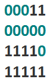

<h1 style='text-align: center;'> E. Hamming Triples</h1>

<h5 style='text-align: center;'>time limit per test: 1 second</h5>
<h5 style='text-align: center;'>memory limit per test: 256 megabytes</h5>

Little Chris is having a nightmare. Even in dreams all he thinks about is math.

Chris dreams about *m* binary strings of length *n*, indexed with numbers from 1 to *m*. The most horrifying part is that the bits of each string are ordered in either ascending or descending order. For example, Chris could be dreaming about the following 4 strings of length 5:

  The Hamming distance *H*(*a*, *b*) between two strings *a* and *b* of length *n* is the number of positions at which the corresponding symbols are different. 

Сhris thinks that each three strings with different indices constitute a single triple. Chris's delusion is that he will wake up only if he counts the number of such string triples *a*, *b*, *c* that the sum *H*(*a*, *b*) + *H*(*b*, *c*) + *H*(*c*, *a*) is maximal among all the string triples constructed from the dreamed strings.

Help Chris wake up from this nightmare!

## Input

The first line of input contains two space-separated integers *n* and *m* (1 ≤ *n* ≤ 109; 3 ≤ *m* ≤ 105), the length and the number of strings. The next *m* lines contain the description of the strings. The *i*-th line contains two space-separated integers *s**i* and *f**i* (0 ≤ *s**i* ≤ 1; 1 ≤ *f**i* ≤ *n*), the description of the string with index *i*; that means that the first *f**i* bits of the *i*-th string are equal to *s**i*, and the remaining *n* - *f**i* bits are equal to 1 - *s**i*. There can be multiple equal strings in Chris's dream.

## Output

## Output

 a single integer, the number of such string triples among the given that the sum of the Hamming distances between the strings of the triple is maximal.

## Examples

## Input


```
5 4  
0 3  
0 5  
1 4  
1 5  

```
## Output


```
3  

```
## Input


```
10 4  
1 5  
0 5  
0 5  
1 5  

```
## Output


```
4  

```


#### tags 

#2800 #implementation #math #two_pointers 